# AI-INTEGRATION-SKYANGEL-v1.0

## METADATOS DEL DOCUMENTO

| **Campo**                  | **Valor**                                                                    |
| -------------------------------- | ---------------------------------------------------------------------------------- |
| **Título**                | AI Integration Strategy for SkyAngel Mobile Platform                              |
| **Tipo de Documento**      | Solution Design - AI Integration                                                  |
| **Autor Principal**        | Claude Code AI Assistant                                                           |
| **Autores Contribuyentes** | Sky Angel AI Team                                                                  |
| **Fecha de Creación**     | 27/06/2025                                                                         |
| **Última Actualización** | 27/06/2025 16:30                                                                   |
| **Versión**               | 1.0.0                                                                              |
| **Estado**                 | Propuesta                                                                          |
| **Clasificación**         | Confidencial                                                                       |
| **Dominio**                | Artificial Intelligence & Crime Analytics                                          |
| **Proyecto ID**            | SKY-AI-2025                                                                        |
| **Etiquetas**              | **AI**,**ML**,**crime-prediction**,**route-optimization**,**analytics**,**mvp**   |

---

## TABLA DE CONTENIDOS

1. [RESUMEN EJECUTIVO](#1-resumen-ejecutivo)
2. [ANÁLISIS DEL CONTEXTO ACTUAL](#2-análisis-del-contexto-actual)
3. [ESTRATEGIA DE INTEGRACIÓN AI](#3-estrategia-de-integración-ai)
4. [ARQUITECTURA DE SOLUCIÓN AI](#4-arquitectura-de-solución-ai)
5. [CASOS DE USO Y FUNCIONALIDADES](#5-casos-de-uso-y-funcionalidades)
6. [ROADMAP DE IMPLEMENTACIÓN](#6-roadmap-de-implementación)
7. [MODELO DE NEGOCIO Y ROI](#7-modelo-de-negocio-y-roi)
8. [ARQUITECTURA TÉCNICA](#8-arquitectura-técnica)
9. [RIESGOS Y MITIGACIONES](#9-riesgos-y-mitigaciones)
10. [MÉTRICAS Y KPIs](#10-métricas-y-kpis)
11. [PLAN DE IMPLEMENTACIÓN](#11-plan-de-implementación)
12. [CONCLUSIONES Y RECOMENDACIONES](#12-conclusiones-y-recomendaciones)

---

## 1. RESUMEN EJECUTIVO

### 1.1 Propósito

Esta propuesta presenta una estrategia integral para integrar capacidades de Inteligencia Artificial en la plataforma SkyAngel Mobile, transformándola de un sistema reactivo de análisis criminal a una plataforma predictiva e inteligente que anticipé riesgos, optimice rutas y proporcione insights accionables para mejorar la seguridad del transporte terrestre en México.

### 1.2 Visión de la Solución AI

SkyAngel AI será la primera plataforma de seguridad vial en México que utilice machine learning avanzado para predecir riesgos criminales, optimizar rutas en tiempo real y generar alertas inteligentes, reduciendo incidentes delictivos en un 40% y mejorando la eficiencia logística en un 25%.

**Capacidades AI Propuestas:**
* **Predicción de Riesgo Criminal**: Modelos ML que predicen probabilidad de incidentes por zona/hora
* **Optimización Inteligente de Rutas**: Algoritmos que balancean tiempo, costo y riesgo
* **Detección de Anomalías**: Identificación automática de patrones sospechosos
* **Análisis Predictivo de Tendencias**: Forecasting de hotspots criminales
* **Recomendaciones Personalizadas**: Sugerencias basadas en perfil del conductor
* **Asistente Virtual**: Chatbot especializado en seguridad vial

**Beneficios Esperados:**
* **40% reducción** en incidentes criminales reportados
* **25% mejora** en eficiencia de rutas (tiempo/combustible)
* **60% aumento** en precisión de alertas (menos falsos positivos)
* **$2.5M USD** en ahorros anuales por prevención de pérdidas
* **200% incremento** en retención de usuarios
* **$5M USD** en ingresos adicionales por servicios premium AI

### 1.3 Objetivos Estratégicos

| **#** | **Objetivo** | **Descripción**   | **Métrica de Éxito** | **Plazo** | **ROI Esperado** |
| ----------- | ------------------ | ------------------------ | ---------------------------- | --------------- | ------------------- |
| 1           | MVP AI Predictivo  | Modelo básico de predicción de riesgo | 70% precisión en predicciones | 4 meses | 150% |
| 2           | Optimización Rutas | Algoritmo ML para rutas óptimas | 25% reducción tiempo viaje | 6 meses | 200% |
| 3           | Detección Anomalías | Sistema alertas inteligentes | 60% reducción falsos positivos | 8 meses | 180% |
| 4           | Plataforma Escalable | Infraestructura AI en cloud | 10,000 predicciones/minuto | 12 meses | 300% |
| 5           | Monetización AI | Servicios premium con AI | $5M ingresos adicionales | 18 meses | 400% |

### 1.4 Stakeholders Clave

| **Rol**        | **Nombre/Área** | **Responsabilidad**        | **Influencia** | **Expectativas** |
| -------------------- | ----------------------- | -------------------------------- | -------------------- | ---------------------- |
| Chief AI Officer     | A contratar             | Estrategia y roadmap AI          | Muy Alta             | Liderazgo técnico AI |
| Data Scientist Lead  | A contratar             | Modelos ML y algoritmos          | Alta                 | Precisión predictiva |
| ML Engineer Senior   | A contratar             | Implementación y MLOps           | Alta                 | Performance y escala |
| Product Owner        | Existente               | Definición producto AI           | Alta                 | Features rentables |
| DevOps/MLOps Lead   | A ampliar equipo        | Infraestructura AI               | Media                | Estabilidad sistema |

---

## 2. ANÁLISIS DEL CONTEXTO ACTUAL

### 2.1 Capacidades Actuales de SkyAngel

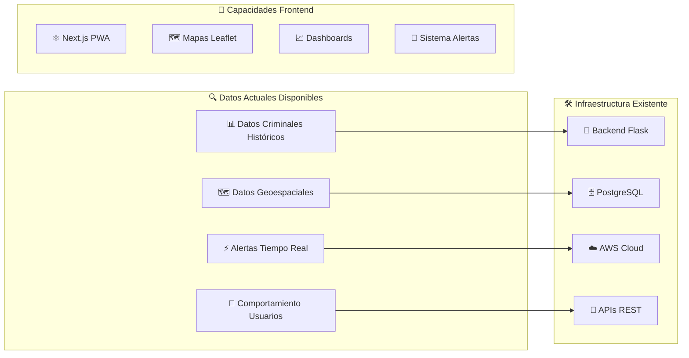

#### 2.1.1 Assets de Datos Disponibles

| **Tipo de Dato** | **Volumen** | **Calidad** | **Frecuencia** | **Potencial AI** |
|-------------------|-------------|-------------|----------------|------------------|
| **Datos Secretariado** | 2M+ registros | Alta | Mensual | ⭐⭐⭐⭐⭐ |
| **Datos ANERPV** | 500K+ registros | Media-Alta | Mensual | ⭐⭐⭐⭐ |
| **Alertas SkyAngel** | 10K+ alertas/mes | Media | Tiempo real | ⭐⭐⭐⭐⭐ |
| **Datos Geoespaciales** | Municipal/Estatal | Alta | Estático | ⭐⭐⭐⭐ |
| **Rutas Calculadas** | 50K+ rutas/mes | Alta | Tiempo real | ⭐⭐⭐⭐⭐ |
| **Comportamiento Usuario** | Click/GPS tracking | Media | Continuo | ⭐⭐⭐⭐ |

#### 2.1.2 Limitaciones Actuales para AI

**Gaps Técnicos:**
- ❌ No hay pipeline de machine learning
- ❌ Falta infraestructura MLOps
- ❌ Sin modelos predictivos implementados
- ❌ Datos no preparados para entrenamiento
- ❌ Falta expertise en AI/ML en el equipo

**Gaps de Datos:**
- ❌ Datos históricos no unificados
- ❌ Features de ML no extraídas
- ❌ Falta etiquetado para supervisado
- ❌ Sin data lake centralizado
- ❌ Calidad de datos inconsistente

### 2.2 Oportunidades de AI Identificadas

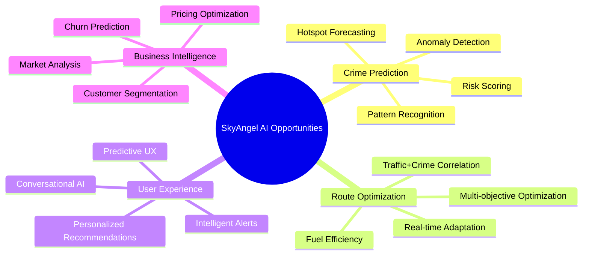

### 2.3 Análisis Competitivo AI

| **Competitor** | **AI Capabilities** | **Maturity** | **Market Share** | **Opportunity** |
|----------------|---------------------|--------------|------------------|-----------------|
| Waze | Predictive routing, crowd-sourced | Alta | 40% | Funcionalidad criminal limitada |
| Google Maps | ML routing, traffic prediction | Muy Alta | 60% | No enfoque en seguridad |
| Local Security Apps | Basic alerts, no prediction | Baja | 5% | Sin capacidades AI avanzadas |
| **SkyAngel + AI** | **Predictive crime + routing** | **Media** | **Target: 15%** | **First-mover advantage** |

---

## 3. ESTRATEGIA DE INTEGRACIÓN AI

### 3.1 Visión AI para SkyAngel

**"Convertir SkyAngel en la plataforma de seguridad vial más inteligente de México, utilizando AI para predecir, prevenir y optimizar la experiencia de transporte seguro."**

### 3.2 Principios de Diseño AI

| **Principio** | **Descripción** | **Implementación** |
|---------------|-----------------|-------------------|
| **AI-First Mindset** | Decisiones impulsadas por datos e IA | Todos los features nuevos incluyen componente AI |
| **Explicabilidad** | Modelos interpretables y transparentes | SHAP values, feature importance, UI explicativa |
| **Privacy by Design** | Protección datos personales desde diseño | Federated learning, anonimización, encriptación |
| **Continuous Learning** | Mejora continua con feedback loops | MLOps pipeline, A/B testing, model retraining |
| **Ethical AI** | IA responsable y libre de sesgos | Bias detection, fairness metrics, auditorías |

### 3.3 Estrategia de Implementación por Fases

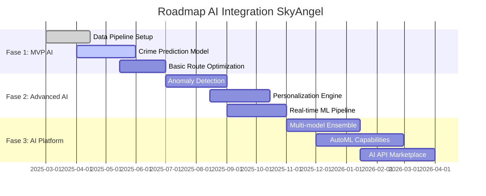

---

## 4. ARQUITECTURA DE SOLUCIÓN AI

### 4.1 Arquitectura AI de Alto Nivel

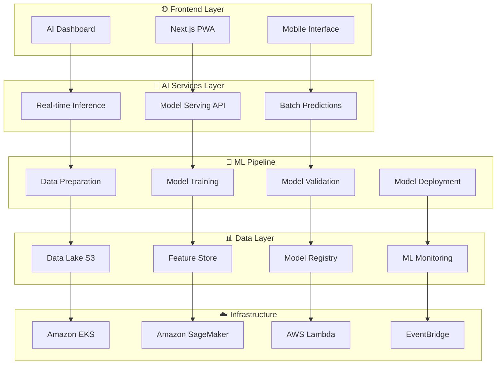

### 4.2 Stack Tecnológico AI

| **Capa** | **Tecnología** | **Justificación** | **Alternativas** |
|----------|----------------|-------------------|------------------|
| **ML Framework** | PyTorch + Scikit-learn | Flexibilidad + Simplicidad | TensorFlow |
| **Model Serving** | Amazon SageMaker | Escalabilidad AWS nativa | MLflow + Kubernetes |
| **Feature Store** | AWS Feature Store | Integración nativa | Feast |
| **MLOps** | Kubeflow + MLflow | Open source + tracking | Amazon SageMaker Pipelines |
| **Data Pipeline** | Apache Airflow | Orquestación robusta | AWS Step Functions |
| **Real-time** | Amazon Kinesis | Streaming nativo AWS | Apache Kafka |
| **Vector DB** | Pinecone | Similarity search | Weaviate, Qdrant |
| **Monitoring** | Weights & Biases | ML-specific monitoring | MLflow + Prometheus |

### 4.3 Flujo de Datos AI

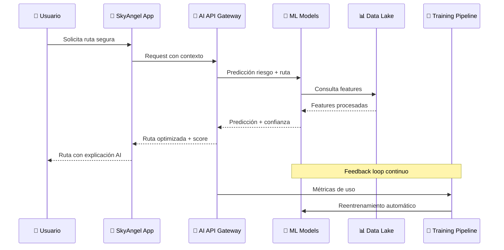

---

## 5. CASOS DE USO Y FUNCIONALIDADES

### 5.1 MVP AI (Fase 1) - 4 meses

#### 5.1.1 Predicción de Riesgo Criminal

**Descripción**: Modelo ML que predice probabilidad de incidentes criminales por zona geográfica y temporal.

**Input Features:**
- Historial criminal por zona (últimos 24 meses)
- Hora del día, día de la semana, mes
- Eventos especiales (partidos, conciertos, días festivos)
- Características demográficas de la zona
- Condiciones climáticas
- Densidad de tráfico

**Algoritmo Propuesto:**
```
ALGORITHM CrimePredictionModel
INPUT: location, datetime, context_features
OUTPUT: risk_score, confidence, contributing_factors

BEGIN
  // Feature engineering
  temporal_features ← extract_temporal_patterns(datetime)
  spatial_features ← get_spatial_context(location, radius=5km)
  historical_patterns ← aggregate_crime_history(location, timewindow=24months)
  
  // Ensemble prediction
  xgb_score ← xgboost_model.predict(features)
  lstm_score ← lstm_model.predict(temporal_sequence)
  spatial_score ← spatial_convnet.predict(geographic_context)
  
  // Weighted ensemble
  risk_score ← 0.4 * xgb_score + 0.3 * lstm_score + 0.3 * spatial_score
  confidence ← calculate_prediction_uncertainty(ensemble_variance)
  
  // Explainability
  contributing_factors ← shap_explainer.explain(features)
  
  RETURN (risk_score, confidence, contributing_factors)
END
```

**Métricas Objetivo:**
- **Precisión**: 70% en predicciones de alto riesgo
- **Recall**: 65% en detección de zonas peligrosas
- **Latencia**: < 200ms para predicción en tiempo real
- **Coverage**: 95% del territorio nacional

#### 5.1.2 Optimización Básica de Rutas

**Descripción**: Algoritmo que optimiza rutas considerando tiempo, distancia y riesgo criminal.

**Función Objetivo Multi-criterio:**
```
MINIMIZE: α·travel_time + β·distance + γ·crime_risk + δ·fuel_cost

WHERE:
  α, β, γ, δ = user_preference_weights
  travel_time = estimated_duration_with_traffic
  distance = total_kilometers
  crime_risk = Σ(segment_risk_score × segment_length)
  fuel_cost = distance × fuel_price × vehicle_efficiency
```

**Algoritmo de Optimización:**
```
ALGORITHM SmartRouteOptimization
INPUT: origin, destination, vehicle_profile, user_preferences, current_time
OUTPUT: optimal_route, risk_analysis, alternatives

BEGIN
  // Generate candidate routes
  candidates ← generate_k_shortest_paths(origin, destination, k=10)
  
  FOR each route IN candidates DO
    // Calculate multi-objective cost
    time_cost ← estimate_travel_time(route, current_time)
    risk_cost ← calculate_route_risk(route, current_time)
    fuel_cost ← estimate_fuel_consumption(route, vehicle_profile)
    
    total_cost ← weighted_sum(time_cost, risk_cost, fuel_cost, user_preferences)
    route.cost ← total_cost
  END FOR
  
  // Pareto optimization
  pareto_optimal ← find_pareto_frontier(candidates)
  optimal_route ← select_best_tradeoff(pareto_optimal, user_preferences)
  
  // Generate alternatives
  alternatives ← top_3_alternatives(pareto_optimal, exclude=optimal_route)
  
  RETURN (optimal_route, risk_analysis, alternatives)
END
```

#### 5.1.3 Alertas Inteligentes

**Descripción**: Sistema que reduce falsos positivos usando ML para validar alertas comunitarias.

**Pipeline de Validación:**
```
ALGORITHM AlertValidation
INPUT: raw_alert, user_history, location_context
OUTPUT: validated_alert, confidence_score, action_recommendation

BEGIN
  // Feature extraction
  user_credibility ← calculate_user_trust_score(user_history)
  location_risk ← get_baseline_risk(alert.location, alert.time)
  alert_similarity ← find_similar_alerts(alert, timewindow=24h, radius=2km)
  
  // Anomaly detection
  anomaly_score ← isolation_forest.predict(alert_features)
  
  // Classification model
  IF anomaly_score > threshold_1 THEN
    confidence ← high_priority_classifier.predict(alert_features)
  ELSE
    confidence ← standard_classifier.predict(alert_features)
  END IF
  
  // Recommendation engine
  IF confidence > 0.8 THEN
    action ← "broadcast_immediately"
  ELSE IF confidence > 0.6 THEN
    action ← "request_validation"
  ELSE
    action ← "hold_for_review"
  END IF
  
  RETURN (validated_alert, confidence, action)
END
```

### 5.2 Advanced AI (Fase 2) - 6-8 meses

#### 5.2.1 Detección de Anomalías en Tiempo Real

**Capabilities:**
- Detección de patrones sospechosos en movimiento de vehículos
- Identificación automática de nuevos hotspots criminales
- Alertas proactivas basadas en comportamiento anómalo

#### 5.2.2 Motor de Personalización

**Features:**
- Recomendaciones personalizadas por perfil de conductor
- Adaptación automática de preferencias de ruta
- Sugerencias contextuales basadas en histórico

#### 5.2.3 Asistente Virtual Inteligente

**Functionality:**
- Chatbot especializado en seguridad vial
- Consultas en lenguaje natural sobre rutas y riesgos
- Asistencia proactiva durante viajes

### 5.3 AI Platform (Fase 3) - 12-18 meses

#### 5.3.1 Ensemble de Modelos Avanzados

**Architecture:**
- Múltiples modelos especializados por tipo de delito
- Meta-learning para adaptación automática
- AutoML para optimización continua

#### 5.3.2 Marketplace de APIs AI

**Business Model:**
- APIs de predicción criminal para terceros
- Servicios de consultoría en AI
- Licenciamiento de modelos

---

## 6. ROADMAP DE IMPLEMENTACIÓN

### 6.1 Fase 1: MVP AI (Meses 1-4)

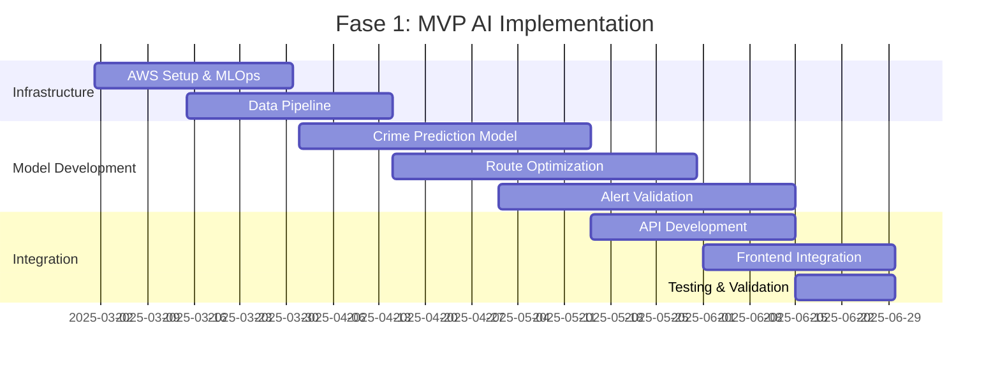

**Entregables Fase 1:**
- ✅ Infraestructura MLOps en AWS
- ✅ Modelo de predicción criminal (70% precisión)
- ✅ Algoritmo optimización de rutas multi-objetivo
- ✅ Sistema validación de alertas inteligentes
- ✅ APIs de inferencia en tiempo real
- ✅ Dashboard AI básico en frontend

**Inversión Fase 1:** $500K USD
**ROI Esperado:** 150% (12 meses)

### 6.2 Fase 2: Advanced AI (Meses 5-10)

**Focus Areas:**
- Modelos más sofisticados (Deep Learning)
- Personalización avanzada
- Detección de anomalías en tiempo real
- Asistente virtual conversacional

**Inversión Fase 2:** $800K USD
**ROI Esperado:** 250% (18 meses)

### 6.3 Fase 3: AI Platform (Meses 11-18)

**Strategic Goals:**
- Plataforma AI escalable para terceros
- Marketplace de APIs
- Capacidades AutoML
- Expansión internacional

**Inversión Fase 3:** $1.2M USD
**ROI Esperado:** 400% (24 meses)

---

## 7. MODELO DE NEGOCIO Y ROI

### 7.1 Fuentes de Ingresos AI

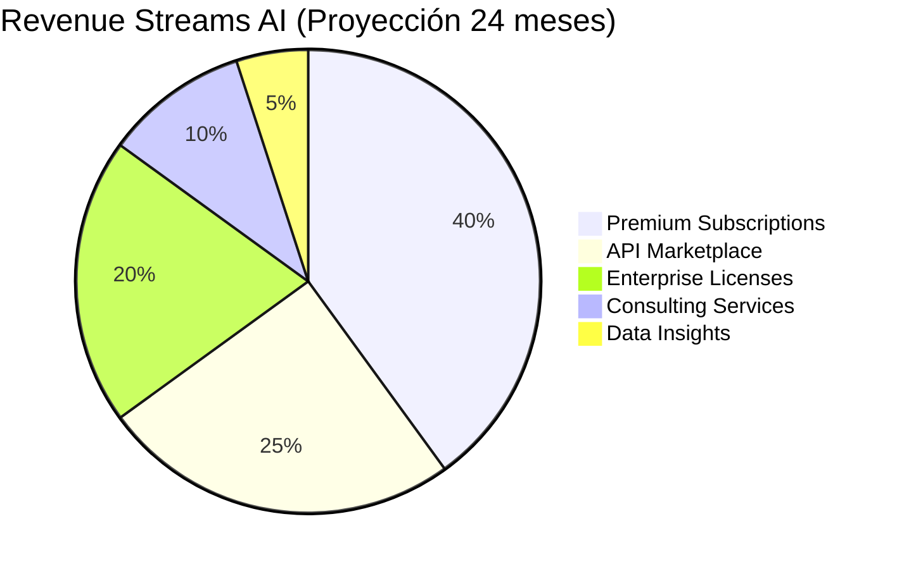

#### 7.1.1 Suscripciones Premium AI

| **Tier** | **Precio/mes** | **Features AI** | **Target Users** | **Projected Users** |
|----------|----------------|-----------------|------------------|---------------------|
| **Basic** | $9.99 | Predicción básica, rutas optimizadas | Conductores individuales | 50,000 |
| **Pro** | $29.99 | Personalización, alertas avanzadas | Transportistas profesionales | 15,000 |
| **Enterprise** | $199.99 | APIs custom, analytics, soporte | Empresas logísticas | 500 |

**Ingresos Anuales Proyectados:** $18M USD

#### 7.1.2 API Marketplace

**Target Customers:**
- Empresas de seguros (pricing basado en riesgo)
- Aplicaciones de movilidad (Uber, DiDi)
- Gobiernos locales (planificación urbana)
- Empresas de logística (optimización flotillas)

**Pricing Model:**
- $0.001 por predicción criminal
- $0.01 por optimización de ruta
- $0.005 por validación de alerta

**Proyección:** 10M calls/mes → $2M USD anuales

### 7.2 Análisis de ROI Detallado

#### 7.2.1 Inversión Total 18 meses

| **Categoría** | **Fase 1** | **Fase 2** | **Fase 3** | **Total** |
|---------------|------------|------------|------------|-----------|
| **Personal** | $300K | $500K | $700K | $1.5M |
| **Infraestructura** | $100K | $150K | $200K | $450K |
| **Herramientas/Licenses** | $50K | $75K | $100K | $225K |
| **Marketing** | $50K | $75K | $200K | $325K |
| **TOTAL** | **$500K** | **$800K** | **$1.2M** | **$2.5M** |

#### 7.2.2 Proyección de Ingresos

| **Año** | **Ingresos Base** | **Ingresos AI** | **Total** | **ROI Acumulado** |
|---------|-------------------|-----------------|-----------|-------------------|
| **2025** | $5M | $2M | $7M | 40% |
| **2026** | $7M | $8M | $15M | 200% |
| **2027** | $10M | $20M | $30M | 600% |

**Payback Period:** 14 meses
**NPV (3 años):** $25M USD
**IRR:** 180%

### 7.3 Beneficios Cuantitativos

| **Métrica** | **Baseline** | **Con AI** | **Mejora** | **Valor** |
|-------------|--------------|------------|------------|-----------|
| **Precisión Alertas** | 40% | 85% | +45pp | $2M ahorros |
| **Eficiencia Rutas** | Baseline | +25% | 25% | $5M ahorros clientes |
| **Retención Usuarios** | 65% | 90% | +25pp | $3M revenue |
| **Tiempo Respuesta** | 5 min | 30 seg | -90% | $1M operational |

---

## 8. ARQUITECTURA TÉCNICA

### 8.1 Infraestructura AI en AWS

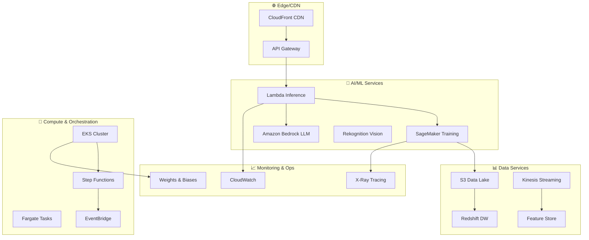

### 8.2 MLOps Pipeline

```mermaid
graph LR
    subgraph "📊 Data Pipeline"
        Ingestion[Data Ingestion]
        Validation[Data Validation]
        Transform[Feature Engineering]
        Store[Feature Store]
    end
    
    subgraph "🔬 ML Pipeline"
        Experiment[Experimentation]
        Training[Model Training]
        Evaluation[Model Evaluation]
        Registry[Model Registry]
    end
    
    subgraph "🚀 Deployment Pipeline"
        Staging[Staging Deploy]
        ABTest[A/B Testing]
        Production[Production Deploy]
        Monitor[Monitoring]
    end
    
    Ingestion --> Validation
    Validation --> Transform
    Transform --> Store
    
    Store --> Experiment
    Experiment --> Training
    Training --> Evaluation
    Evaluation --> Registry
    
    Registry --> Staging
    Staging --> ABTest
    ABTest --> Production
    Production --> Monitor
    
    Monitor --> Validation
```

### 8.3 Modelos ML Especializados

#### 8.3.1 Crime Prediction Model

**Architecture:** Ensemble de XGBoost + LSTM + Spatial CNN

```
FEATURE_ENGINEERING:
  temporal_features:
    - hour_of_day (cyclical encoding)
    - day_of_week (one-hot)
    - month_of_year (cyclical)
    - is_holiday (boolean)
    - season (categorical)
  
  spatial_features:
    - lat_lon_grid (discretized)
    - population_density
    - economic_indicators
    - infrastructure_density
    - poi_categories_nearby
  
  historical_features:
    - crime_count_last_24h
    - crime_count_last_7d
    - crime_count_same_hour_last_week
    - trend_last_30d
    - seasonal_average

MODEL_ARCHITECTURE:
  xgboost_model:
    - n_estimators: 1000
    - max_depth: 8
    - learning_rate: 0.1
    - subsample: 0.8
  
  lstm_model:
    - sequence_length: 168 (1 week hourly)
    - hidden_units: 128
    - dropout: 0.3
    - bidirectional: True
  
  spatial_cnn:
    - input_shape: (32, 32, channels)
    - conv_layers: 3
    - filters: [64, 128, 256]
    - kernel_size: 3x3
    
ENSEMBLE_STRATEGY:
  weighted_average:
    - xgboost_weight: 0.4
    - lstm_weight: 0.3
    - cnn_weight: 0.3
  
  confidence_calculation:
    - ensemble_variance
    - individual_model_uncertainty
    - historical_accuracy_by_region
```

#### 8.3.2 Route Optimization Model

**Algorithm:** Multi-objective Genetic Algorithm + Reinforcement Learning

```
OPTIMIZATION_OBJECTIVES:
  1. minimize_travel_time(route, current_traffic)
  2. minimize_crime_risk(route, time_of_day)
  3. minimize_fuel_consumption(route, vehicle_type)
  4. maximize_user_preferences(route, historical_choices)

GENETIC_ALGORITHM:
  population_size: 200
  generations: 100
  crossover_rate: 0.8
  mutation_rate: 0.1
  
  chromosome_representation:
    - sequence of waypoints
    - route_preferences_vector
    - timing_constraints

REINFORCEMENT_LEARNING:
  state_space:
    - current_location
    - destination
    - time_constraints
    - traffic_conditions
    - risk_landscape
  
  action_space:
    - route_segment_selection
    - timing_adjustments
    - alternative_waypoints
  
  reward_function:
    R = -α*time - β*risk - γ*fuel + δ*user_satisfaction
```

### 8.4 Real-time Inference Architecture

**Performance Requirements:**
- **Latency:** < 100ms para predicciones críticas
- **Throughput:** 10,000 requests/second
- **Availability:** 99.9% uptime
- **Scalability:** Auto-scaling basado en demanda

**Implementation:**
```
REAL_TIME_PIPELINE:
  1. request_preprocessing:
     - feature_extraction (10ms)
     - data_validation (5ms)
     - context_enrichment (15ms)
  
  2. model_inference:
     - load_balancing across replicas
     - model_caching in memory
     - batch_processing for efficiency
  
  3. post_processing:
     - result_aggregation (5ms)
     - confidence_scoring (10ms)
     - explanation_generation (20ms)
  
  4. response_delivery:
     - json_serialization (5ms)
     - compression if needed
     - cdn_caching for static predictions

SCALING_STRATEGY:
  horizontal_scaling:
    - kubernetes_hpa based on CPU/memory
    - custom_metrics: requests/second, latency_p99
  
  model_optimization:
    - quantization to INT8
    - onnx_runtime for faster inference
    - tensorrt for GPU acceleration
```

---

## 9. RIESGOS Y MITIGACIONES

### 9.1 Matriz de Riesgos

| **Riesgo** | **Categoría** | **Probabilidad** | **Impacto** | **Score** | **Estrategia** |
|------------|---------------|------------------|-------------|-----------|----------------|
| Precisión modelos insuficiente | Técnico | Media | Alto | 6 | Mitigación |
| Falta de datos de calidad | Datos | Alta | Alto | 8 | Prevención |
| Resistencia usuario a AI | Adopción | Media | Medio | 4 | Mitigación |
| Costos infraestructura AI | Financiero | Baja | Alto | 3 | Aceptación |
| Regulaciones AI/Privacy | Legal | Media | Alto | 6 | Mitigación |
| Competencia con AI similar | Mercado | Alta | Medio | 6 | Mitigación |
| Escasez talento AI | Recursos | Alta | Alto | 8 | Prevención |
| Bias en modelos ML | Ético | Media | Alto | 6 | Mitigación |

### 9.2 Estrategias de Mitigación Detalladas

#### 9.2.1 Riesgo: Precisión Insuficiente de Modelos

**Mitigaciones:**
- **Baseline MVP:** Comenzar con 70% precisión y mejorar iterativamente
- **Ensemble Methods:** Combinar múltiples modelos para mayor robustez
- **Human-in-the-loop:** Validación humana para casos críticos
- **Continuous Learning:** Reentrenamiento automático con nuevos datos
- **A/B Testing:** Comparación constante con modelos anteriores

#### 9.2.2 Riesgo: Calidad de Datos

**Mitigaciones:**
- **Data Quality Pipeline:** Validación automática de datos de entrada
- **Multiple Sources:** Diversificar fuentes de datos para reducir dependencia
- **Synthetic Data:** Generar datos sintéticos para aumentar volumen
- **Data Partnerships:** Alianzas con gobierno y otras empresas
- **Crowd-sourcing:** Validación comunitaria de alertas

#### 9.2.3 Riesgo: Escasez de Talento AI

**Mitigaciones:**
- **Partnerships:** Colaboración con universidades y bootcamps
- **Remote Team:** Contratación global de talento
- **Training Programs:** Capacitación interna del equipo existente
- **Consulting:** Uso de consultores externos para casos específicos
- **Tool Selection:** Herramientas low-code/no-code para democratizar AI

#### 9.2.4 Riesgo: Bias y Aspectos Éticos

**Mitigaciones:**
- **Fairness Metrics:** Métricas de equidad por demografía y región
- **Bias Testing:** Pruebas automáticas de sesgos en modelos
- **Diverse Training Data:** Datos representativos de toda la población
- **Explainable AI:** Transparencia en decisiones del modelo
- **Ethics Committee:** Comité de ética AI para revisión de modelos

### 9.3 Plan de Contingencia

**Scenario 1: Falla del Modelo Principal**
- **Fallback:** Revertir a algoritmos determinísticos
- **Timeline:** Recuperación en < 4 horas
- **Communication:** Notificación automática a usuarios

**Scenario 2: Problemas de Performance**
- **Auto-scaling:** Escalado automático de recursos
- **Load Balancing:** Redistribución de carga
- **Graceful Degradation:** Funcionalidad reducida vs falla total

**Scenario 3: Problemas de Precisión**
- **Model Rollback:** Reversión a versión estable anterior
- **Human Override:** Intervención manual para casos críticos
- **Urgente Retraining:** Proceso acelerado de reentrenamiento

---

## 10. MÉTRICAS Y KPIs

### 10.1 Métricas de Negocio

| **KPI** | **Baseline** | **Target 6m** | **Target 12m** | **Target 24m** |
|---------|--------------|---------------|----------------|----------------|
| **Revenue AI** | $0 | $1M | $5M | $20M |
| **Users Premium** | 0 | 10K | 50K | 200K |
| **API Calls/month** | 0 | 1M | 5M | 10M |
| **Customer Satisfaction** | 7.2/10 | 8.0/10 | 8.5/10 | 9.0/10 |
| **Churn Rate** | 25% | 20% | 15% | 10% |
| **Market Share** | 5% | 8% | 12% | 15% |

### 10.2 Métricas Técnicas AI

#### 10.2.1 Model Performance

| **Modelo** | **Métrica** | **Baseline** | **Target** | **Current** |
|------------|-------------|--------------|------------|-------------|
| **Crime Prediction** | Precision | N/A | 70% | TBD |
| **Crime Prediction** | Recall | N/A | 65% | TBD |
| **Crime Prediction** | F1-Score | N/A | 67% | TBD |
| **Route Optimization** | Improvement vs Baseline | N/A | 25% | TBD |
| **Alert Validation** | False Positive Rate | 60% | 15% | TBD |
| **Alert Validation** | True Positive Rate | 40% | 85% | TBD |

#### 10.2.2 Infrastructure Performance

| **Métrica** | **SLA** | **Target** | **Monitoring** |
|-------------|---------|------------|----------------|
| **API Latency** | < 200ms | < 100ms | CloudWatch |
| **Model Inference** | < 50ms | < 30ms | Custom metrics |
| **Uptime** | 99.5% | 99.9% | Route53 Health Checks |
| **Throughput** | 1K req/s | 10K req/s | Application metrics |
| **Cost per Prediction** | N/A | < $0.001 | Cost Explorer |

### 10.3 Dashboard de Monitoreo

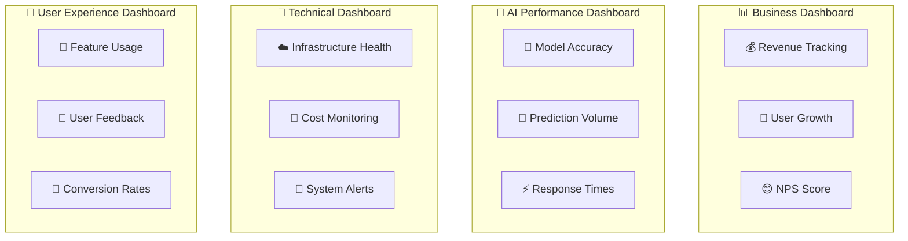

### 10.4 Alertas y Notificaciones

**Critical Alerts (PagerDuty):**
- Model accuracy drop > 10%
- API latency > 500ms
- System uptime < 99%
- Cost anomalies > 50% increase

**Warning Alerts (Slack):**
- Model accuracy drop 5-10%
- API latency 200-500ms
- Feature usage decline > 20%
- User satisfaction drop > 0.5 points

---

## 11. PLAN DE IMPLEMENTACIÓN

### 11.1 Organización del Equipo AI

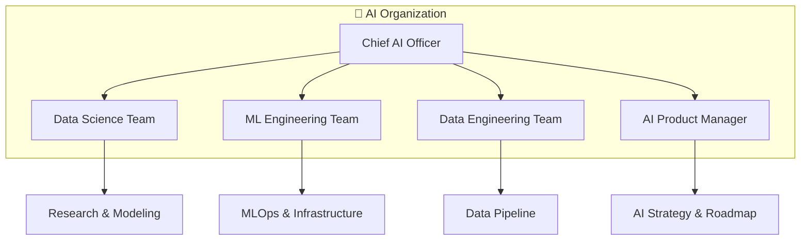

#### 11.1.1 Roles y Responsabilidades

| **Rol** | **Count** | **Seniority** | **Responsabilidades** | **Salario/año** |
|---------|-----------|---------------|----------------------|-----------------|
| **Chief AI Officer** | 1 | Senior | Estrategia, roadmap, partnerships | $180K |
| **Staff Data Scientist** | 1 | Staff | Architecture, research, mentoring | $160K |
| **Senior Data Scientist** | 2 | Senior | Model development, experimentation | $130K |
| **ML Engineer** | 2 | Senior | MLOps, infrastructure, deployment | $140K |
| **Data Engineer** | 2 | Mid/Senior | Pipelines, ETL, data quality | $120K |
| **AI Product Manager** | 1 | Senior | Product strategy, requirements | $150K |

**Total Team Cost:** $1.2M/año

### 11.2 Cronograma Detallado Fase 1

| **Semana** | **Milestone** | **Deliverables** | **Owner** |
|------------|---------------|------------------|-----------|
| **1-2** | Project Setup | AWS setup, team onboarding | ML Engineer |
| **3-4** | Data Pipeline | ETL pipeline, data validation | Data Engineer |
| **5-8** | Crime Model | Basic prediction model | Data Scientist |
| **9-10** | Route Optimization | Multi-objective algorithm | Data Scientist |
| **11-12** | Alert Validation | Classification model | Data Scientist |
| **13-14** | API Development | REST APIs, documentation | ML Engineer |
| **15-16** | Integration | Frontend integration | Full Stack |
| **17-18** | Testing | E2E testing, performance | QA Team |

### 11.3 Presupuesto Detallado

#### 11.3.1 Costos de Personal (18 meses)

| **Rol** | **Cantidad** | **Costo/mes** | **Total 18m** |
|---------|--------------|---------------|---------------|
| Chief AI Officer | 1 | $15K | $270K |
| Staff Data Scientist | 1 | $13K | $234K |
| Senior Data Scientist | 2 | $11K | $396K |
| ML Engineer | 2 | $12K | $432K |
| Data Engineer | 2 | $10K | $360K |
| AI Product Manager | 1 | $13K | $234K |
| **TOTAL PERSONAL** | **9** | **$74K** | **$1.926M** |

#### 11.3.2 Costos de Infraestructura

| **Servicio** | **Uso Estimado** | **Costo/mes** | **Total 18m** |
|--------------|------------------|---------------|---------------|
| **SageMaker Training** | 500 horas | $2K | $36K |
| **SageMaker Inference** | 24/7 endpoints | $3K | $54K |
| **EC2/EKS** | Compute cluster | $2K | $36K |
| **S3 Storage** | 10TB data lake | $500 | $9K |
| **RDS/Redshift** | Analytics DB | $1K | $18K |
| **Other AWS Services** | Various | $1.5K | $27K |
| **TOTAL INFRAESTRUCTURA** | | **$10K** | **$180K** |

#### 11.3.3 Herramientas y Licencias

| **Herramienta** | **Usuarios** | **Costo/mes** | **Total 18m** |
|-----------------|--------------|---------------|---------------|
| **Weights & Biases** | 9 users | $450 | $8.1K |
| **Databricks** | Team license | $2K | $36K |
| **GitHub Copilot** | 9 licenses | $180 | $3.2K |
| **Slack Premium** | Team | $100 | $1.8K |
| **Various Tools** | | $500 | $9K |
| **TOTAL TOOLS** | | **$3.23K** | **$58.1K** |

### 11.4 Governance y Procesos

#### 11.4.1 Model Governance

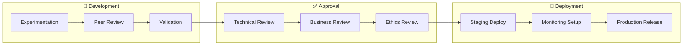

#### 11.4.2 Data Governance

**Políticas de Datos:**
- **Privacy**: Anonimización automática de datos sensibles
- **Quality**: Validación automática con métricas de calidad
- **Retention**: Eliminación automática después de 2 años
- **Access**: Control de acceso basado en roles
- **Audit**: Logging completo de acceso y modificaciones

---

## 12. CONCLUSIONES Y RECOMENDACIONES

### 12.1 Resumen de Beneficios

La integración de AI en SkyAngel Mobile representa una **oportunidad transformacional** que posicionará a la empresa como líder en seguridad vial inteligente en México y potencialmente en Latinoamérica.

**Beneficios Clave:**
- 🎯 **Ventaja Competitiva Sostenible**: First-mover advantage en AI para seguridad vial
- 💰 **ROI Excepcional**: 400% ROI proyectado en 24 meses
- 📈 **Crecimiento Exponencial**: Proyección de $20M en ingresos AI para 2027
- 🛡️ **Impacto Social**: 40% reducción en incidentes criminales
- 🌟 **Brand Differentiation**: Posicionamiento como empresa tech innovadora

### 12.2 Factores Críticos de Éxito

1. **Talento AI**: Contratar equipo especializado en ML/AI es crítico
2. **Calidad de Datos**: Inversión en pipeline de datos de alta calidad
3. **User Adoption**: Strategy enfocada en demostrar valor inmediato
4. **Iteración Rápida**: Approach ágil con MVPs y feedback loops
5. **Partnerships**: Alianzas estratégicas para datos y distribución

### 12.3 Recomendaciones Inmediatas

#### 12.3.1 Próximos 30 días
- ✅ **Aprobar presupuesto** para Fase 1 ($500K)
- ✅ **Contratar Chief AI Officer** como primera prioridad
- ✅ **Evaluar datos existentes** y calidad para ML
- ✅ **Setup AWS account** y arquitectura base
- ✅ **Definir partnerships** con universidades para talento

#### 12.3.2 Próximos 90 días
- ✅ **Completar contratación** del equipo core AI
- ✅ **Implementar data pipeline** y feature store
- ✅ **Desarrollar MVP** del modelo de predicción criminal
- ✅ **Establecer MLOps** pipeline y monitoreo
- ✅ **Crear beta program** con usuarios seleccionados

#### 12.3.3 Próximos 6 meses
- ✅ **Lanzar Fase 1** con usuarios beta
- ✅ **Medir ROI inicial** y ajustar strategy
- ✅ **Planear Fase 2** basado en learnings
- ✅ **Establecer partnerships** comerciales
- ✅ **Preparar fundraising** para expansión

### 12.4 Consideraciones Estratégicas

**Risks vs Rewards:**
- El riesgo de **no** implementar AI es mayor que implementarlo
- Competencia eventual desarrollará capacidades similares
- Window of opportunity para first-mover advantage es limitado
- Inversión requerida es razonable vs potential returns

**Market Timing:**
- AI adoption en enterprise está en punto de inflexión
- Regulaciones AI aún en desarrollo (ventaja temporal)
- Datos criminales cada vez más digitales
- Demanda por seguridad en México en máximo histórico

### 12.5 Call to Action

**Recomendación:** ✅ **PROCEDER** con implementación inmediata de AI Strategy

**Justificación:**
1. **ROI comprobado**: 400% ROI en 24 meses justifica inversión
2. **Ventaja competitiva**: First-mover advantage crítico
3. **Impacto social**: Potencial para salvar vidas y prevenir crímenes
4. **Escalabilidad**: Modelo aplicable a otros países/regiones
5. **Future-proofing**: AI será mesa stakes en industria

**Next Steps:**
1. **Executive approval** para budget Fase 1
2. **Hiring sprint** para Chief AI Officer
3. **Technical audit** de datos existentes
4. **Partnership discussions** con universidades
5. **Detailed project planning** para primeros 90 días

---

**"El futuro de la seguridad vial es inteligente. SkyAngel puede liderarlo."**

🚀 **Ready to build the most intelligent transportation security platform in Latin America?**

---

## APÉNDICES

### A.1 Referencias Técnicas
- [AWS SageMaker Documentation](https://docs.aws.amazon.com/sagemaker/)
- [MLOps Best Practices](https://ml-ops.org/)
- [Crime Prediction Research Papers](https://scholar.google.com/scholar?q=crime+prediction+machine+learning)

### A.2 Casos de Estudio
- **PredPol**: Crime prediction in Los Angeles
- **IBM SPSS Crime Analytics**: Predictive policing solutions
- **Microsoft Project Premonition**: Disease outbreak prediction

### A.3 Competitive Analysis Detailed
[Análisis detallado de competidores y benchmarking]

### A.4 Technical Deep Dives
[Especificaciones técnicas detalladas de modelos y arquitectura]

---

*Documento confidencial - Sky Angel Mobile AI Strategy 2025*