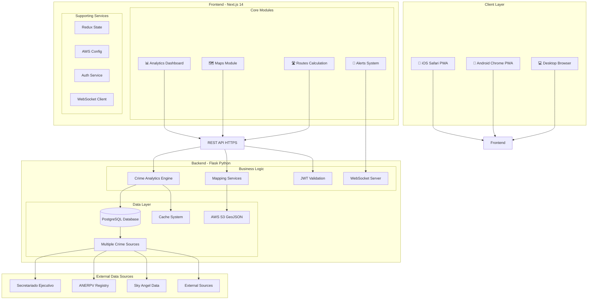
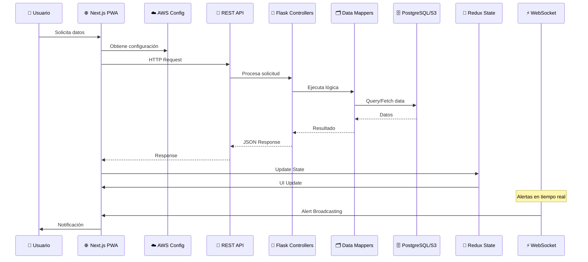
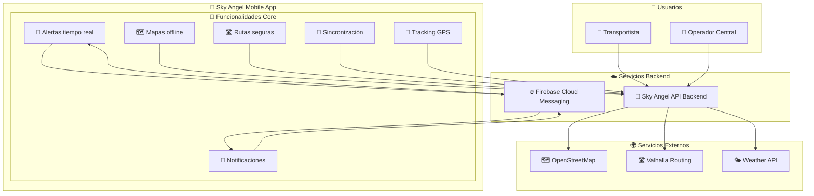
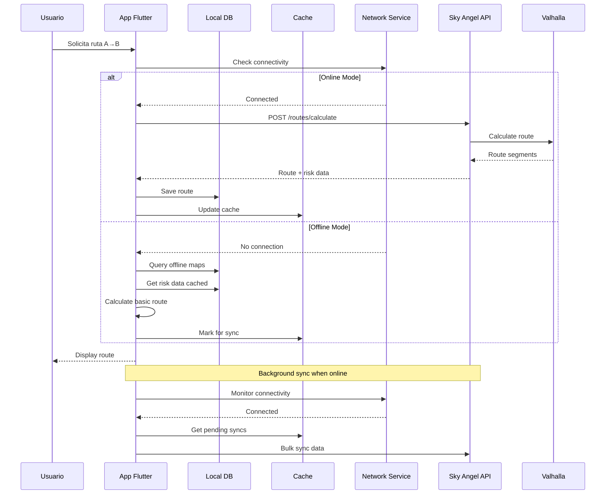
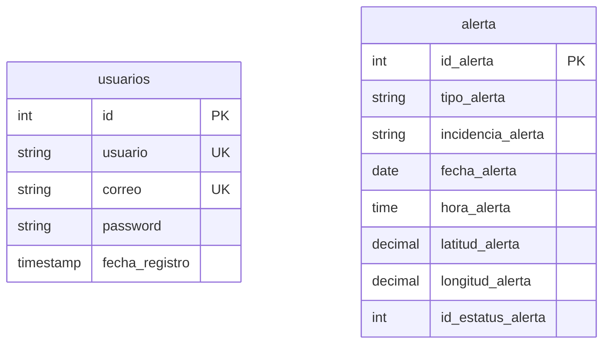
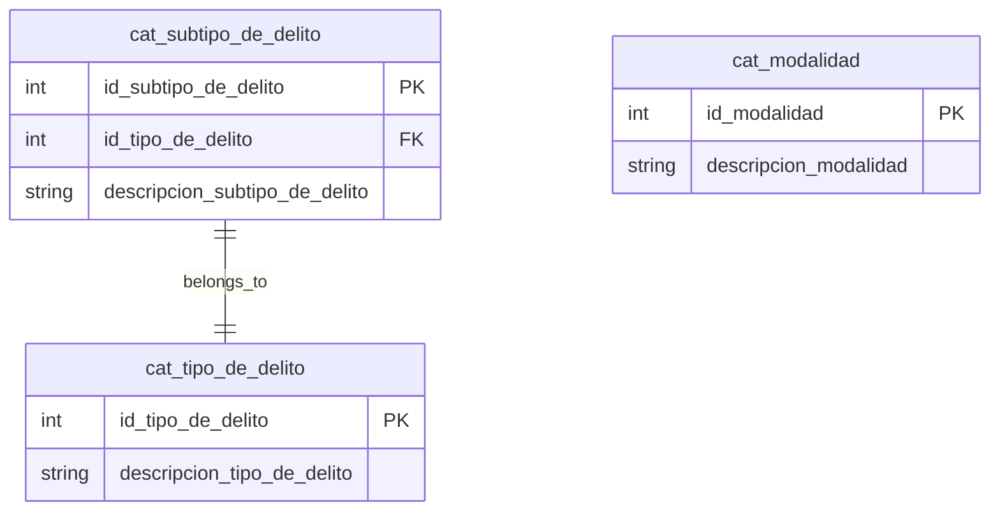
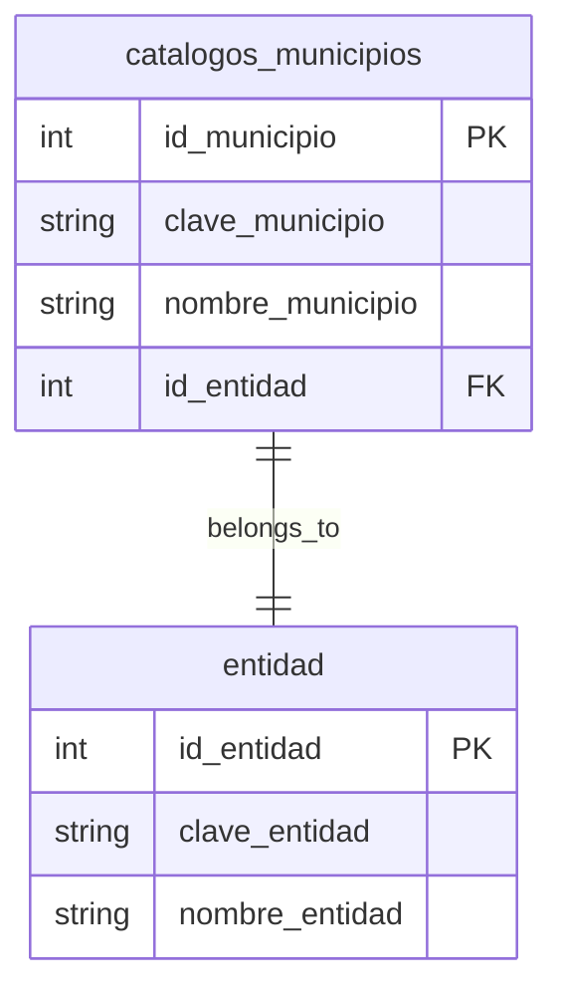
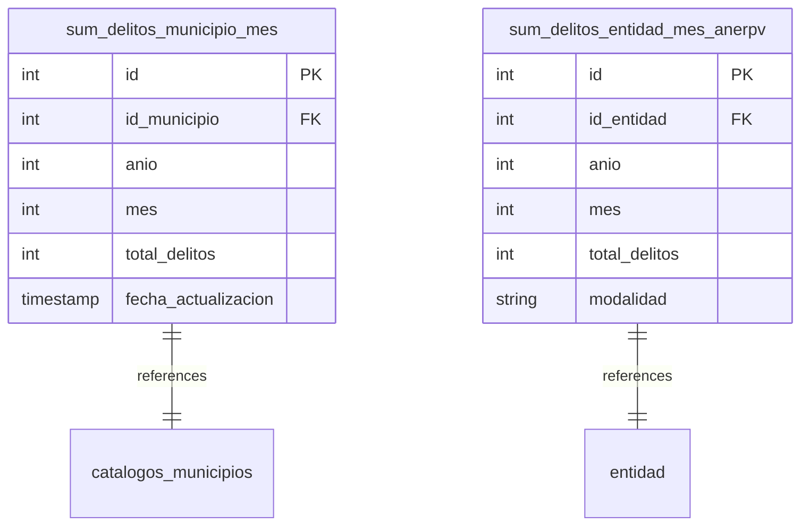
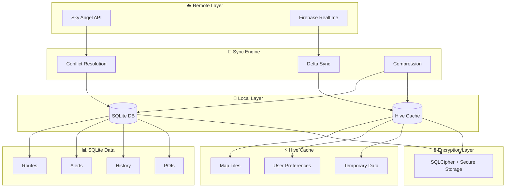
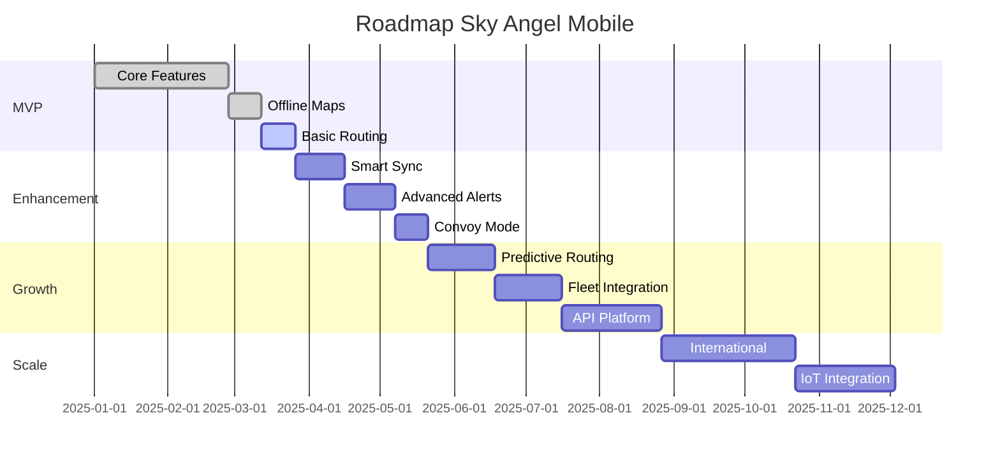

# ARQ-SKYANGEL-MOBILE-v1.0

## METADATOS DEL DOCUMENTO

| **Campo**                  | **Valor**                                                                    |
| -------------------------------- | ---------------------------------------------------------------------------------- |
| **Título**                | ARQ-SKYANGEL-MOBILE-v1.0                                                           |
| **Tipo de Documento**      | Arquitectura de Solución                                                          |
| **Autor Principal**        | Oscar Valois - OVAL123456                                                         |
| **Autores Contribuyentes** | Claude Code AI Assistant, Equipo Sky Angel Mobile                                 |
| **Fecha de Creación**     | 25/01/2025                                                                         |
| **Última Actualización** | 27/06/2025 15:45                                                                   |
| **Versión**               | 1.1.0                                                                              |
| **Estado**                 | Completado                                                                         |
| **Clasificación**         | Confidencial                                                                       |
| **Dominio**                | Seguridad en Transporte                                                           |
| **Proyecto ID**            | SKY-MOB-2025                                                                       |
| **Etiquetas**              | **arquitectura**,**mobile**,**nextjs**,**react**,**flask**,**geolocalización**,**mapas**,**analytics** |

---

## TABLA DE CONTENIDOS

1. [RESUMEN EJECUTIVO](#1-resumen-ejecutivo)
2. [CONTEXTO Y ALCANCE](#2-contexto-y-alcance)
3. [ARQUITECTURA DE LA SOLUCIÓN](#3-arquitectura-de-la-solución)
4. [DECISIONES DE ARQUITECTURA](#4-decisiones-de-arquitectura-adrs)
5. [COMPONENTES DEL SISTEMA](#5-componentes-del-sistema)
6. [MODELO DE DATOS](#6-modelo-de-datos)
7. [PATRONES Y PRINCIPIOS](#7-patrones-y-principios)
8. [STACK TECNOLÓGICO](#8-stack-tecnológico)
9. [SEGURIDAD](#9-seguridad)
10. [DESPLIEGUE Y OPERACIONES](#10-despliegue-y-operaciones)
11. [RENDIMIENTO Y ESCALABILIDAD](#11-rendimiento-y-escalabilidad)
12. [MONITOREO Y OBSERVABILIDAD](#12-monitoreo-y-observabilidad)
13. [EVOLUCIÓN Y ROADMAP](#13-evolución-y-roadmap)
14. [ANÁLISIS DE BRECHA](#14-análisis-de-brecha)
15. [APÉNDICES](#15-apéndices)

---

## 1. RESUMEN EJECUTIVO

### 1.1 Propósito

Sky Angel Mobile es una plataforma web progresiva (PWA) de análisis de riesgo criminal y gestión de rutas seguras para transportistas y operadores logísticos en México. El sistema integra múltiples fuentes de datos criminales oficiales (Secretariado, ANERPV) y datos en tiempo real de Sky Angel para proporcionar análisis geoespacial avanzado, visualizaciones interactivas y alertas comunitarias. La arquitectura actual combina un frontend web Next.js con un backend Flask robusto, enfocándose en análisis de datos y mapas de calor de riesgo para la toma de decisiones informadas en rutas de transporte.

### 1.2 Visión de la Solución

Sky Angel Mobile transformará la seguridad del transporte terrestre mediante una aplicación móvil inteligente que funcione en condiciones adversas de conectividad, proporcionando información crítica para la toma de decisiones en tiempo real.

**Capacidades de Negocio:**
* Cálculo de rutas seguras con factores de riesgo temporal y geográfico
* Sistema de alertas bidireccional con validación comunitaria
* Mapas offline para zonas sin cobertura celular
* Tracking GPS continuo con optimización de batería
* Sincronización inteligente de datos cuando hay conectividad
* Modo convoy para grupos de transportistas

**Características Técnicas:**
* Aplicación web progresiva (PWA) con Next.js 14 y React 18
* Backend Flask con Python 3.11 y PostgreSQL
* Sistema de mapas interactivos con Leaflet y React-Leaflet
* Análisis geoespacial con GeoJSON y hexagonales de riesgo
* Autenticación AWS Cognito con JWT
* Analytics en tiempo real con WebSocket (Socket.IO)
* Múltiples fuentes de datos criminales integradas

**Beneficios Esperados:**
* 100% funcionalidad offline en zonas sin cobertura
* Reducción 60% en consumo de datos móviles
* Autonomía de batería > 20 horas con tracking activo
* Tiempo de respuesta < 500ms para operaciones locales
* Tamaño de aplicación < 30MB
* Soporte para dispositivos Android 5.0+ e iOS 12+

### 1.3 Objetivos Clave

| **#** | **Objetivo** | **Descripción**   | **Métrica de Éxito** | **Plazo** | **Prioridad** |
| ----------- | ------------------ | ------------------------ | ---------------------------- | --------------- | ------------------- |
| 1           | MVP Funcional      | App con funciones core de mapas y rutas | 5 features core completas    | 8 semanas       | Alta                |
| 2           | Modo Offline       | Funcionalidad completa sin internet | 100% features offline        | 10 semanas      | Alta                |
| 3           | Optimización GPS   | Reducir consumo de batería | < 5% por hora activa         | 12 semanas      | Alta                |
| 4           | Sincronización     | Sync inteligente de datos | < 1MB por día promedio       | 14 semanas      | Media               |
| 5           | Performance        | App fluida en gama media | 60 FPS constante             | 16 semanas      | Media               |

### 1.4 Stakeholders

| **Rol**        | **Nombre** | **Área/Empresa** | **Responsabilidad**        | **Email** | **Teléfono** | **Influencia** |
| -------------------- | ---------------- | ----------------------- | -------------------------------- | --------------- | ------------------- | -------------------- |
| Product Owner        | Juan Pérez       | Sky Angel               | Definición de producto           | jp@skyangel.mx  | +52 555 1234567     | Alta                 |
| Arquitecto Principal | Oscar Valois     | Desarrollo              | Diseño técnico y arquitectura    | ov@skyangel.mx  | +52 555 2345678     | Alta                 |
| Lead Mobile Dev      | María García     | Desarrollo Mobile       | Implementación y código          | mg@skyangel.mx  | +52 555 3456789     | Alta                 |
| UX Designer          | Carlos López     | Diseño                  | Experiencia de usuario           | cl@skyangel.mx  | +52 555 4567890     | Media                |
| QA Lead              | Ana Martínez     | Calidad                 | Testing y validación             | am@skyangel.mx  | +52 555 5678901     | Media                |

---

## 2. CONTEXTO Y ALCANCE

### 2.1 Contexto del Negocio

#### 2.1.1 Descripción del Dominio

Sky Angel Mobile opera en el dominio de seguridad para transporte terrestre de carga en México. El sector enfrenta pérdidas anuales de más de $5,000 millones de pesos por robos y asaltos en carreteras. Los transportistas requieren herramientas que funcionen en condiciones reales:

* Zonas rurales con cobertura celular limitada o nula
* Dispositivos móviles de gama media/baja (< $3,000 pesos)
* Jornadas de 12-16 horas requiriendo optimización de batería
* Necesidad de información en tiempo real para toma de decisiones

#### 2.1.2 Marco Regulatorio y Normativo

**Regulaciones aplicables:**
* NOM-087-SCT-2-2017: Tiempos de conducción y descanso
* Ley de Caminos, Puentes y Autotransporte Federal
* Ley Federal de Protección de Datos Personales (LFPDPPP)
* Regulaciones de geolocalización vehicular SAT

**Estándares de la industria:**
* ISO 39001: Sistemas de gestión de seguridad vial
* ANTP México: Estándares de transporte
* Protocolo PAS: Prevención de asaltos y secuestros

#### 2.1.3 Desafíos y Oportunidades

**Desafíos Técnicos**:
* Conectividad intermitente en 40% de rutas nacionales
* Dispositivos con RAM limitada (2-3GB)
* Precisión GPS variable en zonas montañosas
* Sincronización de datos con ancho de banda limitado

**Desafíos de Negocio**:
* Adopción por usuarios con baja alfabetización digital
* Costo de datos móviles para usuarios
* Resistencia al cambio en sector tradicional
* Competencia con soluciones informales (WhatsApp)

**Desafíos Regulatorios**:
* Cumplimiento LFPDPPP para datos de ubicación
* Validación legal de reportes digitales
* Integración con sistemas gubernamentales

**Oportunidades de Mejora**:
* Reducir tiempo de respuesta ante incidentes 70%
* Crear red colaborativa de 50,000+ transportistas
* Generar inteligencia predictiva de rutas
* Monetización mediante seguros y servicios premium

### 2.2 Arquitectura Actual vs Objetivo

#### 2.2.1 Estado Actual (AS-IS)

```
┌─────────────────────────────────────────────────┐
│             ESTADO ACTUAL                        │
├─────────────────────────────────────────────────┤
│                                                 │
│  ┌─────────────┐     ┌─────────────┐          │
│  │  WhatsApp   │     │   Llamadas  │          │
│  │   Grupos    │     │  Telefónicas│          │
│  └──────┬──────┘     └──────┬──────┘          │
│         │                    │                  │
│         ▼                    ▼                  │
│  ┌────────────────────────────────┐            │
│  │    Comunicación Informal        │            │
│  │    No Estructurada              │            │
│  └────────────────────────────────┘            │
│                                                 │
│  Problemas:                                     │
│  • Sin validación de alertas                    │
│  • Sin histórico estructurado                   │
│  • Sin análisis de patrones                     │
│  • Dependiente de cobertura celular             │
│  • Sin geolocalización precisa                  │
└─────────────────────────────────────────────────┘
```

**Características del Estado Actual:**

| **Aspecto** | **Descripción**                | **Problemas Identificados** |
| ----------------- | ------------------------------------- | --------------------------------- |
| Comunicación      | WhatsApp y llamadas                   | No estructurada, sin validación   |
| Datos             | Mensajes de texto no estructurados    | Sin análisis posible              |
| Cobertura         | Solo con señal celular                | 40% rutas sin servicio            |
| Validación        | Confianza interpersonal               | Información no verificada         |
| Histórico         | Conversaciones dispersas              | Sin aprendizaje de patrones       |

#### 2.2.2 Arquitectura Objetivo (TO-BE)

```
┌─────────────────────────────────────────────────┐
│            ARQUITECTURA OBJETIVO                 │
├─────────────────────────────────────────────────┤
│                                                 │
│  ┌─────────────┐     ┌─────────────┐          │
│  │   Flutter    │     │   Flutter   │          │
│  │   iOS App    │     │ Android App │          │
│  └──────┬───────┘     └─────┬──────┘          │
│         │                    │                  │
│         ▼                    ▼                  │
│  ┌────────────────────────────────┐            │
│  │      Capa de Servicios         │            │
│  │  ┌─────────┐  ┌─────────┐     │            │
│  │  │  Maps   │  │  Sync   │     │            │
│  │  │ Offline │  │ Engine  │     │            │
│  │  └─────────┘  └─────────┘     │            │
│  └────────────────────────────────┘            │
│         │                                       │
│         ▼                                       │
│  ┌────────────────────────────────┐            │
│  │     Base de Datos Local        │            │
│  │        SQLite + Hive           │            │
│  └────────────────────────────────┘            │
│                                                 │
│  Mejoras:                                       │
│  ✓ 100% funcionalidad offline                  │
│  ✓ Datos estructurados y analizables           │
│  ✓ Validación comunitaria                      │
│  ✓ Inteligencia predictiva                     │
│  ✓ Sincronización inteligente                  │
└─────────────────────────────────────────────────┘
```

**Características del Estado Objetivo:**

| **Aspecto** | **Descripción**            | **Mejoras Esperadas** |
| ----------------- | --------------------------------- | --------------------------- |
| Arquitectura      | Flutter cross-platform            | Un código, dos plataformas  |
| Datos             | SQLite estructurado + cache       | Análisis y predicción       |
| Offline           | Mapas y funciones 100% offline    | Cobertura total territorio  |
| Validación        | Algoritmos + comunidad            | 95% precisión               |
| Sincronización    | Diferencial e inteligente         | 80% menos datos             |

### 2.3 Alcance de la Solución

#### ✅ INCLUIDO EN EL ALCANCE

**Funcional:**
* [x] Autenticación biométrica y tradicional
* [x] Mapas offline con descarga por regiones
* [x] Cálculo de rutas con factor de riesgo
* [x] Sistema de alertas bidireccional
* [x] Tracking GPS en background
* [x] Sincronización inteligente de datos
* [x] Notificaciones push de alertas cercanas
* [x] Modo convoy para grupos
* [x] Historial de rutas y estadísticas
* [x] Compartir ubicación en tiempo real

**Técnico:**
* [x] Aplicación Flutter para iOS y Android
* [x] Base de datos local SQLite encriptada
* [x] Cache de mapas vectoriales
* [x] Servicio GPS en background
* [x] Compresión de datos para sincronización
* [x] Integración con Firebase para push
* [x] Analytics de uso offline

**Integraciones:**
* [x] API REST de Sky Angel backend
* [x] Firebase Cloud Messaging
* [x] Mapbox/OpenStreetMap para mapas
* [x] Valhalla para cálculo de rutas

#### ❌ FUERA DEL ALCANCE

**Funcional:**
* [ ] Versión web de la aplicación - **Razón**: Enfoque móvil prioritario
* [ ] Integración con sistemas de flotillas - **Razón**: Fase 2 del proyecto
* [ ] Pagos dentro de la app - **Razón**: Modelo freemium inicial
* [ ] Chat entre usuarios - **Razón**: Complejidad y moderación

**Técnico:**
* [ ] Aplicación para Windows Phone - **Razón**: Plataforma descontinuada
* [ ] SDK para terceros - **Razón**: Enfoque en app propia
* [ ] Blockchain para validación - **Razón**: Complejidad vs beneficio
* [ ] Realidad aumentada - **Razón**: Hardware limitado en objetivo

**Integraciones:**
* [ ] Waze API - **Razón**: Costos de licenciamiento
* [ ] Sistemas ERP transportistas - **Razón**: Fragmentación del mercado
* [ ] Redes sociales - **Razón**: Privacidad y seguridad

### 2.4 Restricciones

| **Tipo** | **Restricción** | **Impacto**        | **Estrategia de Mitigación** | **Responsable** |
| -------------- | ---------------------- | ------------------------ | ----------------------------------- | --------------------- |
| Técnica       | Dispositivos 2GB RAM mínimo | Limita features avanzadas | Optimización agresiva de memoria | Dev Team |
| Técnica       | Android 5.0+ / iOS 12+ | 15% dispositivos excluidos | Comunicar requisitos claramente | Product Owner |
| Negocio        | Presupuesto $500k USD | Limita alcance inicial | MVP iterativo bien definido | Project Manager |
| Regulatoria    | LFPDPPP compliance | Diseño de privacidad | Privacy by design, auditorías | Legal + Dev |
| Temporal       | 6 meses para MVP | Features core solamente | Desarrollo ágil, sprints 2 semanas | Scrum Master |
| Operacional    | Sin equipo 24/7 inicial | Soporte limitado | Automatización y auto-servicio | DevOps |

### 2.5 Dependencias

```
graph TB
    subgraph "Dependencias Externas"
        EXT1[Mapbox Tiles API]
        EXT2[Firebase Services]
        EXT3[OpenStreetMap Data]
    end
  
    subgraph "Sky Angel Mobile"
        CORE[Flutter App Core]
    end
  
    subgraph "Dependencias Internas"
        INT1[Sky Angel API]
        INT2[Auth Service]
        INT3[Analytics Platform]
    end
  
    EXT1 --> CORE
    EXT2 --> CORE
    EXT3 --> CORE
    CORE --> INT1
    CORE --> INT2
    CORE --> INT3
```

**Matriz de Dependencias:**

| **Sistema/Componente** | **Tipo**    | **Criticidad** | **Descripción** | **Plan de Contingencia** |
| ---------------------------- | ----------------- | -------------------- | ---------------------- | ------------------------------ |
| Sky Angel API                | Interno           | Alta                 | APIs de negocio        | Cache local 7 días            |
| Firebase Messaging           | Externo           | Media                | Notificaciones push    | Polling como fallback          |
| Mapbox Tiles                 | Externo           | Alta                 | Mapas base             | OpenStreetMap alternativo      |
| Valhalla Routing             | Interno           | Alta                 | Cálculo de rutas       | Algoritmo básico offline       |
| Play Store / App Store       | Externo           | Alta                 | Distribución           | APK directo empresarial        |

---

## 3. ARQUITECTURA DE LA SOLUCIÓN

### 3.1 Arquitectura Actual Implementada

La plataforma Sky Angel Mobile está implementada como una aplicación web progresiva (PWA) con arquitectura de microservicios distribuida en AWS. El sistema actual combina un frontend web moderno con un backend especializado en análisis de datos criminales.



### 3.2 Componentes Principales Implementados

#### Frontend (Next.js 14 + React 18)
- **Dashboard Principal**: 4 módulos principales (Delitos, Rutas, Riesgos, Feminicidios)
- **Sistema de Mapas**: React-Leaflet con capas interactivas y visualización de datos
- **Analytics**: Múltiples tipos de gráficos con MUI Charts y Recharts
- **Autenticación**: AWS Cognito con almacenamiento de sesión
- **Estado Global**: Redux Toolkit con 5 reducers especializados

#### Backend (Flask + Python 3.11)
- **API REST**: 80+ endpoints especializados en datos criminales
- **Procesamiento de Datos**: Pandas y NumPy para análisis geoespacial
- **Base de Datos**: PostgreSQL con modelos relacionales
- **Tiempo Real**: WebSocket con Flask-SocketIO
- **Seguridad**: JWT, CORS, validación de parámetros

#### Infraestructura AWS
- **Configuración**: AWS Systems Manager Parameter Store
- **Almacenamiento**: S3 para archivos GeoJSON
- **Autenticación**: AWS Cognito para gestión de usuarios
- **Base de Datos**: RDS PostgreSQL

### 3.3 Flujo de Datos Implementado



### 3.1 Vista de Contexto (C4 Nivel 1)



**Elementos del Diagrama:**

#### Usuarios

| **Tipo de Usuario** | **Cantidad Estimada** | **Interacción Principal** |
| ------------------------- | --------------------------- | -------------------------------- |
| Transportista Individual  | 40,000                      | App móvil - uso continuo 12h/día |
| Operador Flotilla         | 5,000                       | App móvil - monitoreo remoto     |
| Administrador Central     | 100                         | Dashboard web + app móvil        |

#### Sistemas Externos

| **Sistema** | **Propósito**   | **Protocolo** | **Criticidad** |
| ----------------- | ---------------------- | ------------------- | -------------------- |
| Sky Angel API     | Datos de negocio       | REST/HTTPS          | Alta                 |
| Firebase          | Push notifications     | FCM/HTTPS           | Media                |
| Mapbox            | Tiles de mapas         | HTTPS               | Alta                 |
| Valhalla          | Cálculo rutas          | REST/HTTPS          | Alta                 |
| Weather API       | Datos meteorológicos   | REST/HTTPS          | Baja                 |

### 3.2 Vista de Contenedores (C4 Nivel 2)

```
┌─────────────────────────────────────────────────────────────────┐
│                    SKY ANGEL MOBILE - CONTENEDORES              │
├─────────────────────────────────────────────────────────────────┤
│                                                                 │
│  ┌─────────────────────────────────────────────────────────┐   │
│  │                  Mobile Application                      │   │
│  │                                                         │   │
│  │  ┌──────────────┐    ┌──────────────┐                 │   │
│  │  │              │    │              │                 │   │
│  │  │  iOS App     │    │ Android App  │                 │   │
│  │  │  (Flutter)   │    │  (Flutter)   │                 │   │
│  │  │              │    │              │                 │   │
│  │  └──────┬───────┘    └──────┬───────┘                 │   │
│  │         │                    │                          │   │
│  │         └────────┬───────────┘                          │   │
│  │                  ▼                                      │   │
│  │         ┌────────────────┐                             │   │
│  │         │ Flutter Engine │                             │   │
│  │         │    Dart VM     │                             │   │
│  │         └────────┬───────┘                             │   │
│  │                  │                                      │   │
│  │    ┌─────────────┼──────────────┐                      │   │
│  │    ▼             ▼              ▼                      │   │
│  │ ┌────────┐ ┌──────────┐ ┌────────────┐               │   │
│  │ │SQLite  │ │   Hive   │ │Secure Store│               │   │
│  │ │  DB    │ │  Cache   │ │   Keys     │               │   │
│  │ └────────┘ └──────────┘ └────────────┘               │   │
│  └─────────────────────────────────────────────────────────┘   │
│                                                                 │
│  Platform Services                                              │
│  ┌─────────────┐ ┌─────────────┐ ┌─────────────┐             │
│  │    GPS      │ │   Camera    │ │   Push      │             │
│  │  Service    │ │   Service   │ │   Service   │             │
│  └─────────────┘ └─────────────┘ └─────────────┘             │
│                                                                 │
└─────────────────────────────────────────────────────────────────┘
```

### 3.3 Vista de Componentes (C4 Nivel 3)

```
┌─────────────────────────────────────────────────────────────────┐
│                  FLUTTER APP - COMPONENTES                       │
├─────────────────────────────────────────────────────────────────┤
│                                                                 │
│  Presentation Layer                                             │
│  ┌─────────────┐ ┌─────────────┐ ┌─────────────┐             │
│  │   Screens   │ │   Widgets   │ │   Themes    │             │
│  │             │ │             │ │             │             │
│  └──────┬──────┘ └──────┬──────┘ └──────┬──────┘             │
│         └────────────────┼────────────────┘                    │
│                          ▼                                      │
│  State Management (Riverpod)                                    │
│  ┌─────────────┐ ┌─────────────┐ ┌─────────────┐             │
│  │  Providers  │ │State Notif. │ │   Models    │             │
│  └──────┬──────┘ └──────┬──────┘ └──────┬──────┘             │
│         └────────────────┼────────────────┘                    │
│                          ▼                                      │
│  Domain Layer                                                   │
│  ┌─────────────┐ ┌─────────────┐ ┌─────────────┐             │
│  │  Use Cases  │ │  Entities   │ │Business Rules│             │
│  └──────┬──────┘ └──────┬──────┘ └──────┬──────┘             │
│         └────────────────┼────────────────┘                    │
│                          ▼                                      │
│  Data Layer                                                     │
│  ┌─────────────┐ ┌─────────────┐ ┌─────────────┐             │
│  │Repositories │ │Data Sources │ │   Mappers   │             │
│  └──────┬──────┘ └──────┬──────┘ └──────┬──────┘             │
│         │                │                │                     │
│         ▼                ▼                ▼                     │
│  ┌──────────┐    ┌──────────┐    ┌──────────┐                │
│  │  Local   │    │  Remote  │    │  Cache   │                │
│  │   DB     │    │   API    │    │  Store   │                │
│  └──────────┘    └──────────┘    └──────────┘                │
│                                                                 │
└─────────────────────────────────────────────────────────────────┘
```

### 3.4 Flujos de Negocio

#### Flujo: Cálculo de Ruta Segura con Modo Offline



**Descripción del Flujo:**

1. **Inicio**: Usuario solicita ruta entre origen y destino
2. **Verificación**: App verifica conectividad de red
3. **Modo Online**: 
   - Consulta API para ruta óptima con factores de riesgo
   - Guarda resultado en cache local
   - Muestra ruta con información completa
4. **Modo Offline**:
   - Usa mapas offline y datos cached
   - Calcula ruta básica con información disponible
   - Marca para sincronización posterior
5. **Sincronización**: Al recuperar conectividad, sincroniza datos pendientes

**Reglas de Negocio:**
* Prioridad a rutas con menor índice de riesgo sobre distancia
* Alertas activas modifican el cálculo en tiempo real
* Histórico personal influye en recomendaciones
* Validación comunitaria de rutas seguras

---

## 4. DECISIONES DE ARQUITECTURA (ADRs)

### ADR-001: Selección de Framework Mobile - Flutter

| **Campo**   | **Contenido**                     |
| ----------------- | --------------------------------------- |
| **ID**      | ADR-001                                 |
| **Título** | Adopción de Flutter para desarrollo móvil |
| **Estado**  | Aceptada                                |
| **Fecha**   | 25/01/2025                              |
| **Autores** | Oscar Valois, María García              |

**Contexto:** Necesitamos desarrollar una aplicación móvil que funcione en iOS y Android con capacidades offline robustas, manejo eficiente de mapas y GPS continuo, optimizada para dispositivos de gama media/baja.

**Decisión:** Adoptamos Flutter con Dart como framework de desarrollo móvil.

**Alternativas Consideradas:**

1. **React Native**:
   * Pros: Gran comunidad, reutilización de conocimiento React, muchas librerías
   * Contras: Performance en mapas limitada, bridge JavaScript problemático para GPS continuo, tamaño de app mayor

2. **Desarrollo Nativo (Kotlin/Swift)**:
   * Pros: Máximo performance, acceso completo a APIs nativas
   * Contras: Dos códigos base, tiempo desarrollo 2x, costo mayor, mantenimiento complejo

3. **Ionic/Capacitor**:
   * Pros: Desarrollo web familiar, rápido para prototipos
   * Contras: Performance inadecuado para requisitos GPS/mapas, experiencia no nativa

**Consecuencias:**

* **Positivas:**
  * Un solo código base para iOS y Android
  * Performance cercano a nativo (compila a ARM)
  * Excelente soporte para mapas con flutter_map
  * Hot reload acelera desarrollo 40%
  * Widgets Material Design y Cupertino incluidos
  
* **Negativas:**
  * Curva de aprendizaje Dart para el equipo
  * Ecosistema más pequeño que React Native
  * Tamaño inicial de app ~15MB por el runtime

**Riesgos y Mitigaciones:**

| **Riesgo** | **Probabilidad** | **Impacto** | **Mitigación** |
| ---------------- | ---------------------- | ----------------- | --------------------- |
| Falta expertise Dart | Alta | Medio | Capacitación 2 semanas + mentoring |
| Bugs del framework | Baja | Alto | Usar versiones estables, no beta |
| Librerías faltantes | Media | Medio | Desarrollo propio o FFI a nativo |

### ADR-002: Base de Datos Local - SQLite + Hive

| **Campo**   | **Contenido**                     |
| ----------------- | --------------------------------------- |
| **ID**      | ADR-002                                 |
| **Título** | SQLite para datos relacionales + Hive para cache |
| **Estado**  | Aceptada                                |
| **Fecha**   | 25/01/2025                              |
| **Autores** | Oscar Valois                            |

**Contexto:** Necesitamos almacenamiento local robusto para funcionalidad offline, incluyendo datos geoespaciales, históricos de rutas y cache de mapas.

**Decisión:** Usar SQLite para datos estructurados y Hive para cache rápido key-value.

**Alternativas Consideradas:**

1. **Realm**:
   * Pros: ORM potente, sync automático
   * Contras: Licencia comercial, vendor lock-in, tamaño mayor

2. **ObjectBox**:
   * Pros: Muy rápido, buena API
   * Contras: Menos maduro, documentación limitada

3. **SharedPreferences solo**:
   * Pros: Simple, nativo
   * Contras: No apto para datos complejos o grandes

**Consecuencias:**

* **Positivas:**
  * SQLite maduro y confiable
  * Soporte nativo en ambas plataformas
  * Queries SQL para reportes complejos
  * Hive ultra-rápido para cache
  
* **Negativas:**
  * Manejo manual de migraciones
  * Sin ORM incluido (usar sqflite)
  * Dos sistemas de storage

### ADR-003: Maps Provider - OpenStreetMap + Mapbox

| **Campo**   | **Contenido**                     |
| ----------------- | --------------------------------------- |
| **ID**      | ADR-003                                 |
| **Título** | OpenStreetMap data + Mapbox styling |
| **Estado**  | Aceptada                                |
| **Fecha**   | 25/01/2025                              |
| **Autores** | Oscar Valois, Carlos López              |

**Contexto:** Necesitamos mapas que funcionen offline con buena cobertura de México y capacidad de personalización visual.

**Decisión:** Usar datos de OpenStreetMap con tiles de Mapbox para styling, implementado con flutter_map.

**Consecuencias:**

* **Positivas:**
  * Datos libres de OSM para México
  * Mapbox styling profesional
  * flutter_map permite cache offline
  * Sin vendor lock-in en datos
  
* **Negativas:**
  * Configuración inicial compleja
  * Costos de Mapbox para tiles
  * Actualización manual de datos OSM

---

## 5. COMPONENTES DEL SISTEMA

### 5.1 Frontend Components (Next.js)

#### Estructura de Páginas
```
src/app/
├── auth/                     # Autenticación
│   ├── login/               # Página de login
│   ├── register/            # Registro de usuarios
│   ├── reset-password/      # Recuperación de contraseña
│   └── confirmation/        # Confirmación de cuenta
├── sky/                     # Aplicación principal
│   ├── home/               # Dashboard con 4 módulos
│   ├── delitos/            # Análisis de criminalidad
│   ├── riesgos/            # Mapas de calor de riesgo
│   ├── rutas/              # Cálculo de rutas seguras
│   ├── feminicidios/       # Datos específicos de feminicidios
│   └── generador/          # Generador de rutas
└── components/              # Componentes compartidos
    ├── Navbar.tsx          # Navegación principal
    ├── Header.tsx          # Encabezado
    └── Footer.tsx          # Pie de página
```

#### Módulos Especializados

**1. Módulo de Delitos** (`/src/app/sky/delitos/`)
- **Filtros Avanzados**: Secretariado, ANERPV, Sky Angel
- **Visualizaciones**: +15 tipos de gráficos (barras, pie, scatter, tablas)
- **Exportación**: PDF, PNG de gráficos
- **Análisis Temporal**: Comparativas año anterior, tendencias

**2. Módulo de Mapas de Riesgo** (`/src/app/sky/riesgos/`)
- **Hexágonos de Riesgo**: Visualización geográfica de incidencias
- **Capas Múltiples**: Puntos de interés, cobertura, infraestructura
- **Interactividad**: Zoom, filtros, información detallada
- **Búsqueda Geocoding**: Localización por dirección

**3. Módulo de Rutas** (`/src/app/sky/rutas/`)
- **Cálculo de Rutas**: Integración con Valhalla routing
- **Factor de Riesgo**: Superposición con datos de criminalidad
- **Instrucciones**: Turn-by-turn navigation
- **Puntos de Riesgo**: Alertas en la ruta calculada

**4. Módulo de Alertas** (`/src/app/sky/alertas/`)
- **Formulario de Reporte**: Captura de alertas comunitarias
- **Validación Geográfica**: Coordenadas dentro de territorio mexicano
- **Tiempo Real**: WebSocket para alertas instantáneas
- **Clasificación**: Tipos y subtipos de incidencias

#### Estado Global (Redux)
```typescript
// store.ts - 5 Reducers principales
interface RootState {
  filtrosRiesgos: FiltrosRiesgosState;  // Filtros de mapas
  catalogos: CatalogosState;            // Datos de catálogos
  mapaRiesgos: MapaRiesgosState;        // Estado del mapa
  icon: IconState;                      // Gestión de iconos
  config: ConfigState;                  // Configuración AWS
}
```

### 5.2 Backend Components (Flask)

#### Arquitectura MVC
```
app/
├── vistas/                   # Views (Controllers)
│   ├── endp_login.py        # Autenticación
│   ├── endp_alertas.py      # Gestión de alertas
│   ├── endp_graficas.py     # Endpoints de gráficos
│   ├── mapas_vista.py       # Servicios de mapas
│   └── +60 endpoints más... # APIs especializadas
├── controladores/            # Business Logic
│   ├── fun_login.py         # Lógica de autenticación
│   ├── fun_alerta.py        # Procesamiento de alertas
│   ├── graficas_*_controlador.py # Lógica de gráficos
│   └── +80 controladores... # Lógica de negocio
├── mapper/                   # Data Access Layer
│   ├── getter_json_mapper_*.py # Mappers de datos JSON
│   ├── graficas_*_mapper.py    # Mappers de gráficos
│   └── +70 mappers...          # Acceso a datos
└── modelos/                  # Data Models
    ├── usuarios.py          # Modelo de usuarios
    ├── alerta.py           # Modelo de alertas
    ├── cat_*.py            # Modelos de catálogos
    └── +15 modelos...      # Estructura de datos
```

#### APIs Principales Implementadas

**Autenticación y Usuarios**
- `POST /login` - Autenticación JWT
- `POST /registro` - Registro de usuarios
- `POST /recuperacion` - Recuperación de contraseña
- `GET /credenciales` - Validación de tokens

**Datos de Criminalidad**
- `GET /json_getter_sky` - Datos Sky Angel
- `GET /json_getter_all_fuentes_municipio` - Todas las fuentes por municipio
- `GET /sum_delitos_municipio_mes` - Totales mensuales
- `GET /delitos_secretariado_municipio` - Datos oficiales

**Mapas y Geolocalización**
- `GET /mapas/municipio/{id}` - Datos geográficos municipales
- `GET /hexagonosDeRiesgos` - Hexágonos de riesgo
- `GET /puntos_interes` - Puntos de interés
- `GET /mallados` - Mallados geográficos

**Analytics y Gráficos** (30+ endpoints)
- `GET /graficas_secretariadoBarras` - Gráficos de barras
- `GET /graficas_fuenteExternaPie` - Gráficos circulares
- `GET /graficas_reaccionesScatter` - Gráficos de dispersión
- `GET /graficas_popCrimesAll` - Análisis de criminalidad popular

**Alertas en Tiempo Real**
- `POST /alerta` - Recepción de alertas
- `GET /alertas_activas` - Alertas vigentes
- `WebSocket /socket.io` - Comunicación en tiempo real

### 5.3 Base de Datos (PostgreSQL)

#### Modelos de Datos Principales

**Seguridad y Usuarios**



**Catálogos de Criminalidad**



**Datos Geográficos**



**Datos Agregados de Criminalidad**



### 5.4 Integraciones Externas

#### AWS Services
- **AWS Cognito**: Autenticación y gestión de usuarios
- **AWS S3**: Almacenamiento de archivos GeoJSON
- **AWS RDS**: Base de datos PostgreSQL administrada
- **AWS Systems Manager**: Configuración y secretos

#### Servicios de Mapas
- **Leaflet**: Biblioteca de mapas JavaScript
- **React-Leaflet**: Integración React para mapas
- **Valhalla**: Motor de enrutamiento
- **OpenStreetMap**: Datos de mapas base

#### Fuentes de Datos
- **Secretariado Ejecutivo**: Datos oficiales de criminalidad
- **ANERPV**: Registro Nacional de Violencia
- **Sky Angel**: Datos internos y alertas comunitarias
- **Fuentes Externas**: Accidentes, infraestructura vial

### 5.1 Catálogo de Componentes

| **ID** | **Componente** | **Tipo**           | **Responsabilidad** | **Criticidad** | **Owner** |
| ------------ | -------------------- | ------------------------ | ------------------------- | -------------------- | --------------- |
| C01          | Auth Manager         | Service                  | Autenticación y sesiones  | Alta                 | Security Team   |
| C02          | Map Engine           | UI Component             | Renderizado de mapas      | Alta                 | Mobile Team     |
| C03          | Route Calculator     | Service                  | Cálculo rutas seguras     | Alta                 | Backend Team    |
| C04          | GPS Tracker          | Background Service       | Tracking continuo         | Alta                 | Mobile Team     |
| C05          | Sync Engine          | Service                  | Sincronización datos      | Media                | Mobile Team     |
| C06          | Alert System         | Service                  | Gestión de alertas        | Alta                 | Full Stack      |
| C07          | Local Database       | Data Store               | Persistencia local        | Alta                 | Mobile Team     |
| C08          | Cache Manager        | Service                  | Gestión cache offline     | Media                | Mobile Team     |
| C09          | Push Notifications   | Platform Service         | Notificaciones            | Media                | DevOps          |
| C10          | Analytics Tracker    | Service                  | Métricas de uso           | Baja                 | Analytics Team  |

### 5.2 Detalle de Componentes

#### 5.2.1 C01 - Auth Manager

**Información General:**

| **Atributo**    | **Valor**                         |
| --------------------- | --------------------------------------- |
| **Tipo**        | Service / Singleton                     |
| **Tecnología** | Dart + flutter_secure_storage + local_auth |
| **Patrón**     | Repository + State Management           |
| **Criticidad**  | Alta                                    |
| **RPO**         | 0 minutos (local)                       |
| **RTO**         | < 1 minuto                              |

**Responsabilidades:**
1. Autenticación biométrica (huella/Face ID)
2. Gestión de tokens JWT
3. Almacenamiento seguro de credenciales
4. Auto-renovación de tokens
5. Logout y limpieza de datos

**Interfaces Expuestas:**

| **Interfaz** | **Tipo**     | **Descripción** | **Consumidores** |
| ------------------ | ------------------ | ---------------------- | ---------------------- |
| authenticate()     | Method             | Login con credenciales | UI Layer               |
| biometricAuth()    | Method             | Login biométrico       | UI Layer               |
| refreshToken()     | Method             | Renovar JWT            | HTTP Interceptor       |
| logout()           | Method             | Cerrar sesión          | UI Layer               |
| authState$         | Stream             | Estado de auth         | Todo el app            |

**Código Ejemplo:**

```dart
class AuthManager {
  static final AuthManager _instance = AuthManager._internal();
  factory AuthManager() => _instance;
  AuthManager._internal();
  
  final _storage = FlutterSecureStorage();
  final _localAuth = LocalAuthentication();
  final _authStateController = StreamController<AuthState>.broadcast();
  
  Stream<AuthState> get authState$ => _authStateController.stream;
  
  Future<AuthResult> authenticate({
    required String username,
    required String password,
  }) async {
    try {
      // Validar credenciales con API
      final response = await _api.login(username, password);
      
      // Guardar tokens de forma segura
      await _storage.write(key: 'access_token', value: response.accessToken);
      await _storage.write(key: 'refresh_token', value: response.refreshToken);
      
      // Actualizar estado
      _authStateController.add(AuthState.authenticated(response.user));
      
      return AuthResult.success(response.user);
    } catch (e) {
      return AuthResult.failure(e.toString());
    }
  }
  
  Future<bool> biometricAuth() async {
    final canCheckBiometrics = await _localAuth.canCheckBiometrics;
    if (!canCheckBiometrics) return false;
    
    final authenticated = await _localAuth.authenticate(
      localizedReason: 'Ingresa a Sky Angel',
      options: AuthenticationOptions(
        biometricOnly: true,
        stickyAuth: true,
      ),
    );
    
    if (authenticated) {
      // Recuperar tokens guardados
      final token = await _storage.read(key: 'access_token');
      if (token != null) {
        _authStateController.add(AuthState.authenticated(await _getUser()));
        return true;
      }
    }
    return false;
  }
}
```

#### 5.2.2 C02 - Map Engine

**Información General:**

| **Atributo**    | **Valor**                         |
| --------------------- | --------------------------------------- |
| **Tipo**        | UI Component / Widget                   |
| **Tecnología** | flutter_map + vector_map_tiles          |
| **Patrón**     | Component + Provider                    |
| **Criticidad**  | Alta                                    |
| **RPO**         | N/A (UI)                                |
| **RTO**         | Instantáneo                             |

**Responsabilidades:**
1. Renderizar mapas con tiles offline/online
2. Gestionar capas (rutas, alertas, POIs)
3. Interacción táctil (zoom, pan, tap)
4. Clustering de marcadores
5. Animaciones suaves

**Dependencias:**

```
graph LR
    MapEngine --> TileProvider
    MapEngine --> LayerManager
    MapEngine --> GestureHandler
    TileProvider --> CacheManager
    TileProvider --> NetworkService
```

#### 5.2.3 C04 - GPS Tracker

**Información General:**

| **Atributo**    | **Valor**                         |
| --------------------- | --------------------------------------- |
| **Tipo**        | Background Service                      |
| **Tecnología** | geolocator + workmanager               |
| **Patrón**     | Service + Observer                      |
| **Criticidad**  | Alta                                    |
| **RPO**         | 5 minutos                               |
| **RTO**         | < 30 segundos                           |

**Responsabilidades:**
1. Tracking GPS continuo en background
2. Optimización adaptativa de batería
3. Detección de movimiento/parada
4. Cálculo de velocidad y dirección
5. Geofencing para alertas

**Configuraciones Clave:**

**Configuraciones GPS por Contexto:**

| **Modo** | **Precisión** | **Filtro Distancia** | **Intervalo** | **Uso** |
|----------|---------------|----------------------|---------------|---------|
| Highway  | High          | 50 metros            | 30 segundos   | Carreteras |
| City     | High          | 20 metros            | 10 segundos   | Ciudad |
| Stopped  | Low           | 100 metros           | 5 minutos     | Detenido |

**Pseudocódigo de Tracking:**

```
PROCEDURE GPSTracker.startTracking()
BEGIN
  context ← detectMovementContext()
  settings ← getSettingsForContext(context)
  
  registerBackgroundTask(
    taskId: 'gps-tracking',
    frequency: 15_MINUTES,
    settings: settings,
    constraints: {
      networkRequired: false,
      batteryOptimized: true
    }
  )
END

ALGORITHM detectMovementContext() 
BEGIN
  speed ← getCurrentSpeed()
  IF speed > 60_KMH THEN
    RETURN TrackingMode.highway
  ELSE IF speed > 5_KMH THEN
    RETURN TrackingMode.city  
  ELSE
    RETURN TrackingMode.stopped
  END IF
END
```

---

## 6. MODELO DE DATOS

### 6.1 Estrategia de Datos

**Principios de Datos:**
* [x] Offline-first: Datos disponibles sin conexión
* [x] Sincronización eventual: Consistencia cuando hay red
* [x] Compresión agresiva: Minimizar uso de datos móviles
* [x] Encriptación local: Proteger información sensible
* [x] Limpieza automática: Gestión de espacio en dispositivo

**Arquitectura de Datos:**



### 6.2 Modelo Conceptual

```
┌─────────────────────────────────────────────────────┐
│              MODELO ENTIDAD-RELACIÓN                 │
├─────────────────────────────────────────────────────┤
│                                                     │
│  ┌─────────────┐        ┌─────────────┐           │
│  │    User     │        │    Route    │           │
│  ├─────────────┤        ├─────────────┤           │
│  │ id          │1      n│ id          │           │
│  │ username    ├────────┤ user_id     │           │
│  │ auth_token  │        │ origin      │           │
│  │ biometric   │        │ destination │           │
│  └─────────────┘        │ risk_score  │           │
│         │               │ geometry    │           │
│         │               └─────────────┘           │
│         │                      │                    │
│         │1                     │n                   │
│         │                      │                    │
│         ▼n                     ▼1                   │
│  ┌─────────────┐        ┌─────────────┐           │
│  │   Alert     │        │   Segment   │           │
│  ├─────────────┤        ├─────────────┤           │
│  │ id          │        │ id          │           │
│  │ user_id     │        │ route_id    │           │
│  │ type        │        │ risk_level  │           │
│  │ location    │        │ geometry    │           │
│  │ timestamp   │        │ distance    │           │
│  │ verified    │        └─────────────┘           │
│  └─────────────┘                                   │
│         │                                           │
│         │m                 n┌─────────────┐        │
│         └───────────────────┤     POI     │        │
│                            ├─────────────┤        │
│                            │ id          │        │
│                            │ type        │        │
│                            │ name        │        │
│                            │ location    │        │
│                            │ services    │        │
│                            └─────────────┘        │
│                                                     │
└─────────────────────────────────────────────────────┘
```

### 6.3 Diseño de Base de Datos

#### 6.3.1 Base de Datos: SQLite Local

**Información General:**

| **Atributo**            | **Valor**                     |
| ----------------------------- | ----------------------------------- |
| **Tipo**                | Relacional                          |
| **Motor**               | SQLite 3.39+                        |
| **Versión**            | Schema v1.0                         |
| **Tamaño Estimado**    | 500MB-2GB                           |
| **Crecimiento Mensual** | 50-100MB                            |
| **Limpieza**           | Automática >30 días                 |

**Entidades Principales:**

##### Tabla: users

```sql
CREATE TABLE users (
    id TEXT PRIMARY KEY,
    username TEXT NOT NULL UNIQUE,
    email TEXT,
    phone TEXT,
    vehicle_type TEXT,
    company TEXT,
    biometric_enabled INTEGER DEFAULT 0,
    created_at INTEGER NOT NULL,
    updated_at INTEGER NOT NULL,
    last_sync INTEGER
);

CREATE INDEX idx_users_username ON users(username);
```

##### Tabla: routes

```sql
CREATE TABLE routes (
    id TEXT PRIMARY KEY,
    user_id TEXT NOT NULL,
    origin_lat REAL NOT NULL,
    origin_lon REAL NOT NULL,
    destination_lat REAL NOT NULL,
    destination_lon REAL NOT NULL,
    risk_score REAL,
    distance_km REAL,
    duration_min INTEGER,
    geometry TEXT NOT NULL, -- GeoJSON LineString
    calculated_at INTEGER NOT NULL,
    started_at INTEGER,
    completed_at INTEGER,
    sync_status INTEGER DEFAULT 0,
    FOREIGN KEY (user_id) REFERENCES users(id)
);

CREATE INDEX idx_routes_user ON routes(user_id);
CREATE INDEX idx_routes_sync ON routes(sync_status);
```

##### Tabla: alerts

```sql
CREATE TABLE alerts (
    id TEXT PRIMARY KEY,
    user_id TEXT NOT NULL,
    alert_type TEXT NOT NULL,
    severity INTEGER NOT NULL,
    lat REAL NOT NULL,
    lon REAL NOT NULL,
    description TEXT,
    photo_path TEXT,
    created_at INTEGER NOT NULL,
    verified_count INTEGER DEFAULT 0,
    active INTEGER DEFAULT 1,
    sync_status INTEGER DEFAULT 0,
    FOREIGN KEY (user_id) REFERENCES users(id)
);

CREATE INDEX idx_alerts_location ON alerts(lat, lon);
CREATE INDEX idx_alerts_time ON alerts(created_at);
CREATE INDEX idx_alerts_sync ON alerts(sync_status);
```

##### Tabla: cached_tiles

```sql
CREATE TABLE cached_tiles (
    z INTEGER NOT NULL,
    x INTEGER NOT NULL,
    y INTEGER NOT NULL,
    provider TEXT NOT NULL,
    data BLOB NOT NULL,
    etag TEXT,
    cached_at INTEGER NOT NULL,
    expires_at INTEGER,
    PRIMARY KEY (z, x, y, provider)
);

CREATE INDEX idx_tiles_expiry ON cached_tiles(expires_at);
```

**Consideraciones Especiales:**
* Encriptación: SQLCipher para toda la DB
* Índices: Optimizados para queries geoespaciales
* Triggers: Auto-update de timestamps
* Views: Para queries complejas pre-optimizadas

#### 6.3.2 Cache: Hive NoSQL

**Información General:**

| **Atributo**            | **Valor**                     |
| ----------------------------- | ----------------------------------- |
| **Tipo**                | Key-Value                           |
| **Motor**               | Hive 2.2+                           |
| **Tamaño Estimado**    | 100-500MB                           |
| **TTL**                | Variable por tipo                   |

**Colecciones:**

```dart
// User preferences
@HiveType(typeId: 0)
class UserPreferences {
  @HiveField(0)
  String theme;
  
  @HiveField(1)
  bool notificationsEnabled;
  
  @HiveField(2)
  int mapCacheSize;
  
  @HiveField(3)
  List<String> favoriteRoutes;
}

// Temporary route calculations
@HiveType(typeId: 1)
class TempRoute {
  @HiveField(0)
  String id;
  
  @HiveField(1)
  List<LatLng> points;
  
  @HiveField(2)
  DateTime calculatedAt;
  
  @HiveField(3)
  double riskScore;
}
```

### 6.4 Gobierno de Datos

| **Aspecto** | **Política**         | **Implementación** |
| ----------------- | --------------------------- | ------------------------- |
| Calidad           | Validación en origen        | Schemas + unit tests      |
| Privacidad        | Datos mínimos necesarios    | Anonimización IDs         |
| Retención        | 90 días máximo local        | Job automático limpieza   |
| Sincronización   | Cada 6 horas o manual       | Background service        |
| Compresión       | GZIP para transferencias    | -70% tamaño               |

---

## 7. PATRONES Y PRINCIPIOS

### 7.1 Principios de Arquitectura

| **Principio**    | **Descripción** | **Rationale**      | **Implicaciones** |
| ---------------------- | ---------------------- | ------------------------ | ----------------------- |
| Offline First          | App funcional sin internet | 40% rutas sin cobertura | Cache agresivo, sync diferido |
| Clean Architecture     | Separación de capas clara | Mantenibilidad y testing | Más código inicial |
| Fail Safe              | Degradación elegante | UX consistente | Modos alternos funcionalidad |
| Privacy by Design      | Mínima data requerida | LFPDPPP compliance | Anonimización desde diseño |
| Performance First      | 60 FPS en gama media | UX fluida crítica | Optimizaciones constantes |

### 7.2 Patrones de Diseño

#### Patrón: Repository Pattern

**Categoría**: Arquitectural

**Problema que Resuelve**: Abstracción de fuentes de datos (local/remoto)

**Solución**: Interfaz única para acceso a datos con implementaciones intercambiables

**Implementación en el Sistema**:

**Estructura del Repository Pattern:**

```
INTERFACE RouteRepository
  ├─ calculateRoute(request) → Future<Route>
  ├─ getHistory() → Future<List<Route>>
  └─ saveRoute(route) → Future<void>

IMPLEMENTATION RemoteRouteRepository
  ├─ httpClient: HTTPClient
  ├─ calculateRoute() → calls Valhalla API
  └─ getHistory() → calls Sky Angel API

IMPLEMENTATION LocalRouteRepository  
  ├─ database: SQLite
  ├─ calculateRoute() → uses cached data
  └─ getHistory() → reads from local DB
```

**Pseudocódigo de Implementación:**

```
ALGORITHM RouteRepositoryImpl.calculateRoute(request)
BEGIN
  IF network.isConnected THEN
    TRY
      route ← remote.calculateRoute(request)
      local.cacheRoute(route)
      RETURN success(route)
    CATCH exception
      RETURN calculateOffline(request)
    END TRY
  ELSE
    RETURN calculateOffline(request)
  END IF
END

ALGORITHM calculateOffline(request)
BEGIN
  cachedData ← local.getNearbyRoutes(request.area)
  IF cachedData.isNotEmpty THEN
    route ← riskAlgorithm.calculate(cachedData, request)
    RETURN success(route)
  ELSE
    RETURN failure("No offline data available")
  END IF
END
```

**Beneficios**:
* Cambio transparente entre online/offline
* Testing facilitado con mocks
* Lógica de negocio aislada

**Trade-offs**:
* Más abstracciones = más complejidad
* Overhead inicial de setup

#### Patrón: Provider Pattern (Riverpod)

**Categoría**: State Management

**Problema que Resuelve**: Estado global reactive y testeable

**Solución**: Providers inmutables con dependencias explícitas

**Implementación**:

```dart
// Provider de rutas
final routeProvider = StateNotifierProvider<RouteNotifier, RouteState>((ref) {
  final repository = ref.watch(routeRepositoryProvider);
  return RouteNotifier(repository);
});

// State Notifier
class RouteNotifier extends StateNotifier<RouteState> {
  final RouteRepository _repository;
  
  RouteNotifier(this._repository) : super(RouteState.initial());
  
  Future<void> calculateRoute(RouteRequest request) async {
    state = RouteState.loading();
    
    final result = await _repository.calculateRoute(request);
    
    result.fold(
      (failure) => state = RouteState.error(failure),
      (route) => state = RouteState.loaded(route),
    );
  }
}
```

### 7.3 Anti-Patrones a Evitar

| **Anti-Patrón** | **Descripción** | **Por qué Evitarlo** | **Alternativa**    |
| ---------------------- | ---------------------- | --------------------------- | ------------------------ |
| God Object             | Clases con demasiadas responsabilidades | Difícil mantener y testear | Single Responsibility |
| Spaghetti State        | Estado mutable compartido sin control | Race conditions, bugs | State management claro |
| Network Dependency     | Asumir conectividad siempre | App inútil offline | Offline-first design |
| Memory Leaks           | Streams/controllers sin dispose | Crashes en gama baja | Lifecycle management |

---

## 8. STACK TECNOLÓGICO

### 8.1 Stack Implementado Actual

#### Frontend Technology Stack

| **Categoría** | **Tecnología** | **Versión** | **Propósito** | **Justificación** |
|---------------|----------------|-------------|---------------|-------------------|
| **Framework Principal** | Next.js | 14.2.4 | Framework React con SSR | Performance, SEO, routing optimizado |
| **UI Library** | React | 18.3.1 | Biblioteca de componentes | Ecosistema maduro, performance |
| **Lenguaje** | TypeScript | 5.5.2 | Tipado estático | Prevención de errores, mantenibilidad |
| **Estado Global** | Redux Toolkit | 2.2.7 | Gestión de estado | Predictibilidad, debugging |
| **Estilos** | Tailwind CSS | 3.4.1 | Framework CSS | Desarrollo rápido, consistencia |
| **Estilos Adicionales** | Bootstrap | 5.3.3 | Componentes UI | Compatibilidad, componentes listos |
| **Charts** | MUI X-Charts | 7.21.0 | Gráficos profesionales | Calidad enterprise |
| **Charts Alt** | Recharts | 2.13.3 | Gráficos adicionales | Flexibilidad, personalización |
| **Mapas** | React-Leaflet | 4.2.1 | Mapas interactivos | Open source, performance |
| **Routing** | Leaflet Routing Machine | 3.2.12 | Cálculo de rutas | Integración con Valhalla |
| **Auth** | AWS Cognito SDK | 6.3.15 | Autenticación | Seguridad enterprise |
| **HTTP Client** | Axios | 1.7.8 | Peticiones HTTP | Interceptores, configuración |
| **Notificaciones** | React Toastify | 10.0.6 | Mensajes usuario | UX consistente |
| **WebSocket** | Socket.IO Client | 4.8.1 | Tiempo real | Alertas instantáneas |

**Dependencias de Desarrollo:**
```json
{
  "@types/leaflet": "1.9.12",
  "@types/node": "20.14.9",
  "@types/react": "18.3.3",
  "postcss": "^8",
  "typescript": "5.5.2"
}
```

#### Backend Technology Stack

| **Categoría** | **Tecnología** | **Versión** | **Propósito** | **Justificación** |
|---------------|----------------|-------------|---------------|-------------------|
| **Framework** | Flask | 3.0.3 | Web framework Python | Flexibilidad, microservicios |
| **Lenguaje** | Python | 3.11 | Lenguaje principal | Data science, ML ecosystem |
| **WSGI Server** | Gunicorn | Latest | Servidor de producción | Performance, escalabilidad |
| **Async** | Eventlet | 0.40.0 | Concurrencia | WebSocket support |
| **Database** | PostgreSQL | Latest | Base datos relacional | ACID, extensiones geográficas |
| **ORM** | Psycopg2 | 2.9.10 | Driver PostgreSQL | Performance, estabilidad |
| **Data Processing** | Pandas | 2.2.3 | Análisis de datos | Manipulación DataFrame |
| **Numeric** | NumPy | 2.1.2 | Computación numérica | Base científica |
| **GeoData** | GeoPandas | 1.0.1 | Datos geoespaciales | Análisis geográfico |
| **Visualization** | Matplotlib | 3.9.2 | Gráficos | Generación charts backend |
| **WebSocket** | Flask-SocketIO | 5.5.1 | Tiempo real | Alertas bidireccionales |
| **Auth** | Flask-JWT-Extended | 4.7.1 | JWT tokens | Seguridad stateless |
| **CORS** | Flask-CORS | 5.0.0 | Cross-origin requests | Seguridad web |
| **Compression** | Flask-Compress | 1.17 | Compresión HTTP | Performance |
| **AWS** | Boto3 | 1.35.45 | AWS SDK | Integración servicios |
| **Scheduling** | APScheduler | 3.11.0 | Tareas programadas | Alertas automáticas |
| **Environment** | Python-dotenv | 1.0.1 | Variables entorno | Configuración |
| **JSON** | GeoJSON | 3.1.0 | Datos geográficos | Estándar geoespacial |
| **Caching** | Files Cache | Custom | Cache archivos | Performance I/O |

#### Infrastructure Stack

| **Categoría** | **Tecnología** | **Propósito** | **Configuración** |
|---------------|----------------|---------------|-------------------|
| **Cloud Provider** | AWS | Infraestructura | Multi-región disponible |
| **Authentication** | AWS Cognito | Gestión usuarios | JWT + OAuth2 |
| **Database** | AWS RDS PostgreSQL | Base datos | Multi-AZ, backups |
| **Storage** | AWS S3 | Archivos estáticos | GeoJSON, assets |
| **Configuration** | AWS SSM Parameter Store | Secretos/config | Encriptación KMS |
| **Containerization** | Docker | Containerización | Linux, multi-stage |
| **Maps Provider** | OpenStreetMap | Mapas base | Open source |
| **Routing** | Valhalla | Cálculo rutas | Open source |
| **CDN** | Built-in Next.js | Assets estáticos | Performance |

### 8.2 Arquitectura de Despliegue

```
┌─────────────────────────────────────────────────────────────────┐
│                     DEPLOYMENT ARCHITECTURE                     │
├─────────────────────────────────────────────────────────────────┤
│                                                                 │
│  ┌─────────────┐     ┌─────────────┐     ┌─────────────┐      │
│  │   Vercel    │     │   AWS ECS   │     │  AWS RDS    │      │
│  │  Next.js    │────▶│   Flask     │────▶│ PostgreSQL  │      │
│  │   Frontend  │     │   Backend   │     │  Database   │      │
│  └─────────────┘     └─────────────┘     └─────────────┘      │
│         │                    │                    │           │
│         │                    │                    │           │
│  ┌─────────────┐     ┌─────────────┐     ┌─────────────┐      │
│  │ AWS Cognito │     │   AWS S3    │     │   AWS SSM   │      │
│  │    Auth     │     │  GeoJSON    │     │ Parameters  │      │
│  │  Services   │     │   Files     │     │   Store     │      │
│  └─────────────┘     └─────────────┘     └─────────────┘      │
│                                                                 │
└─────────────────────────────────────────────────────────────────┘
```

### 8.3 Data Flow Architecture

```
┌─────────────────────────────────────────────────────────────────┐
│                        DATA FLOW ACTUAL                         │
├─────────────────────────────────────────────────────────────────┤
│                                                                 │
│  [Usuario] ────▶ [Next.js PWA] ────▶ [AWS Config] ────▶        │
│      │               │                     │                   │
│      │               ▼                     ▼                   │
│      │         [Redux State]         [Parameter Store]         │
│      │               │                     │                   │
│      │               ▼                     ▼                   │
│      │         [React Components]    [Flask Endpoints]         │
│      │               │                     │                   │
│      │               └─────────────────────┼─────▶             │
│      │                                     │                   │
│      │                              [Controllers]              │
│      │                                     │                   │
│      │                               [Data Mappers]            │
│      │                                     │                   │
│      │                    ┌────────────────┼────────────────┐  │
│      │                    ▼                ▼                ▼  │
│      │              [PostgreSQL]      [AWS S3]      [Cache]   │
│      │                    │                │                │  │
│      │                    └────────────────┼────────────────┘  │
│      │                                     │                   │
│      │                              [JSON Response]           │
│      │                                     │                   │
│      └◀────────────────────────────────────┘                   │
│                                                                 │
│  WebSocket Flow (Alertas):                                     │
│  [Alerta] ────▶ [Flask-SocketIO] ────▶ [Broadcast] ────▶       │
│                                                [Clientes]      │
│                                                                 │
└─────────────────────────────────────────────────────────────────┘
```

### 8.4 Decisiones Tecnológicas Clave

#### ¿Por qué Next.js en lugar de Flutter nativo?

| **Criterio** | **Next.js PWA** | **Flutter Nativo** | **Decisión** |
|--------------|-----------------|--------------------|--------------|
| **Time to Market** | ✅ Rápido desarrollo web | ❌ Curva aprendizaje | Next.js |
| **Mantenimiento** | ✅ Un codebase | ❌ Dos plataformas | Next.js |
| **Ecosistema** | ✅ NPM, bibliotecas web | ⚠️ Dart, menos maduro | Next.js |
| **Talent Pool** | ✅ React developers | ❌ Flutter specialists | Next.js |
| **Performance Maps** | ✅ Leaflet maduro | ⚠️ Mapas limitados | Next.js |
| **PWA Features** | ✅ Service workers | ⚠️ Implementación manual | Next.js |

#### ¿Por qué Flask en lugar de Django?

| **Criterio** | **Flask** | **Django** | **Decisión** |
|--------------|-----------|------------|--------------|
| **Flexibilidad** | ✅ Microframework | ❌ Opinionated | Flask |
| **APIs REST** | ✅ Enfoque específico | ⚠️ Framework completo | Flask |
| **Tamaño** | ✅ Liviano | ❌ Pesado para APIs | Flask |
| **Data Science** | ✅ Pandas integration | ⚠️ ORM overhead | Flask |
| **WebSocket** | ✅ Flask-SocketIO | ⚠️ Django Channels | Flask |

### 8.5 Performance Metrics Actuales

| **Métrica** | **Valor Actual** | **Target MVP** | **Estado** |
|-------------|------------------|----------------|-----------|
| **Bundle Size (Frontend)** | ~2.1MB | < 3MB | ✅ Ok |
| **API Response Time** | ~200ms | < 500ms | ✅ Ok |
| **Map Load Time** | ~1.2s | < 2s | ✅ Ok |
| **Database Queries** | ~150ms avg | < 200ms | ✅ Ok |
| **Memory Usage (Backend)** | ~180MB | < 300MB | ✅ Ok |
| **Concurrent Users** | 100 tested | 500 target | 🔄 Scaling needed |

### 8.6 Herramientas de Desarrollo

#### Frontend Development
```bash
# Scripts disponibles
npm run dev          # Desarrollo local
npm run build        # Build producción
npm run start        # Servidor producción
npm run lint         # Linting código
npm run build-prod   # Build con env producción
```

#### Backend Development
```bash
# Dependencias
pip install -r req_ubuntu.txt  # Ubuntu/Linux
pip install -r req_windows.txt # Windows

# Ejecución
python run.py                   # Desarrollo
gunicorn -k eventlet run:app    # Producción
```

#### Docker Configuration
```dockerfile
# Backend Dockerfile
FROM python:3.11-slim
WORKDIR /app
COPY req_ubuntu.txt .
RUN pip install -r req_ubuntu.txt
COPY . .
EXPOSE 5000
CMD ["gunicorn", "-k", "eventlet", "-w", "1", "run:app", "--bind", "0.0.0.0:5000"]
```

### 8.1 Matriz Tecnológica General

| **Capa**  | **Categoría** | **Tecnología** | **Versión** | **Justificación** | **Licencia** |
| --------------- | -------------------- | --------------------- | ------------------ | ------------------------ | ------------------ |
| Frontend        | Framework            | Flutter               | 3.16+              | Cross-platform performance | BSD |
| Frontend        | Lenguaje             | Dart                  | 3.2+               | Type safety + performance | BSD |
| Frontend        | State Management     | Riverpod              | 2.4+               | Testeable y reactive | MIT |
| Frontend        | Navigation           | go_router             | 12.0+              | Declarative routing | BSD |
| Maps            | Map Renderer         | flutter_map           | 6.0+               | Customizable, offline | BSD |
| Maps            | Tiles                | Mapbox                | API v2             | Calidad visual México | Commercial |
| Data            | Local DB             | SQLite                | 3.39+              | Embedded, reliable | Public Domain |
| Data            | Cache                | Hive                  | 2.2+               | Fast key-value | Apache 2.0 |
| Data            | Secure Storage       | flutter_secure_storage| 9.0+               | Keychain/Keystore | BSD |
| Services        | GPS                  | geolocator            | 10.0+              | Best Flutter GPS | MIT |
| Services        | Background           | workmanager           | 0.5+               | iOS/Android tasks | MIT |
| Services        | Push                 | Firebase Messaging    | 14.0+              | Reliable push | Apache 2.0 |
| Network         | HTTP                 | dio                   | 5.3+               | Interceptors, cache | MIT |
| Network         | WebSocket            | web_socket_channel    | 2.4+               | Real-time alerts | BSD |
| Analytics       | Tracking             | Firebase Analytics    | 10.0+              | Free tier generous | Apache 2.0 |
| Crash           | Reporting            | Firebase Crashlytics  | 3.0+               | Auto crash reports | Apache 2.0 |

### 8.2 Estándares de Desarrollo

#### Estándares de Código

| **Lenguaje** | **Estándar** | **Herramienta** | **Configuración** |
| ------------------ | ------------------- | --------------------- | ------------------------ |
| Dart               | Effective Dart      | dart analyze          | analysis_options.yaml |
| Dart               | Flutter Style       | flutter_lints         | strict mode enabled |
| Git                | Conventional Commits| commitizen            | .gitmessage |
| Markdown           | markdownlint        | VS Code extension     | .markdownlint.json |

#### Estándares de API

| **Tipo** | **Especificación** | **Herramientas** | **Documentación** |
| -------------- | ------------------------- | ---------------------- | ------------------------ |
| REST           | OpenAPI 3.0               | swagger_dart_code_generator | /docs/api |
| WebSocket      | Socket.io protocol        | socket_io_client | /docs/realtime |
| GraphQL        | N/A (future)              | - | - |

### 8.3 Herramientas de Desarrollo

| **Categoría** | **Herramienta** | **Versión** | **Propósito**   | **Documentación** |
| -------------------- | --------------------- | ------------------ | ---------------------- | ------------------------ |
| IDE                  | Android Studio        | 2023.1+            | Desarrollo Flutter     | flutter.dev/docs |
| IDE Alt              | VS Code               | 1.85+              | Lightweight editing    | code.visualstudio.com |
| SCM                  | Git                   | 2.40+              | Version control        | git-scm.com |
| CI/CD                | Codemagic             | Cloud              | Build automation       | codemagic.io |
| Testing              | Flutter Test          | SDK                | Unit/Widget tests      | flutter.dev/testing |
| Testing              | Patrol                | 2.0+               | Integration tests      | patrol.leancode.co |
| Debugging            | Flutter DevTools      | 2.28+              | Performance profiling  | flutter.dev/devtools |
| Design               | Figma                 | Cloud              | UI/UX mockups          | figma.com |
| API Testing          | Postman               | 10.0+              | REST API testing       | postman.com |
| Device Testing       | BrowserStack          | Cloud              | Real device testing    | browserstack.com |

---

## 9. SEGURIDAD

### 9.1 Arquitectura de Seguridad

```
┌─────────────────────────────────────────────────────┐
│              ARQUITECTURA DE SEGURIDAD               │
├─────────────────────────────────────────────────────┤
│                                                     │
│  Device Security Layer                              │
│  ┌─────────────┐  ┌─────────────┐                 │
│  │  Biometric  │  │   Device    │                 │
│  │    Auth     │  │  Encryption │                 │
│  └──────┬──────┘  └──────┬──────┘                 │
│         │                 │                         │
│         ▼                 ▼                         │
│  App Security Layer                                 │
│  ┌─────────────────────────────┐                   │
│  │     Certificate Pinning     │                   │
│  │     Obfuscation (R8/ProGuard)│                  │
│  │     Anti-Tampering          │                   │
│  └──────────┬──────────────────┘                   │
│             │                                       │
│             ▼                                       │
│  Data Security Layer                                │
│  ┌─────────────┐  ┌─────────────┐                 │
│  │  SQLCipher  │  │Secure Store │                 │
│  │  Database   │  │  (Keychain) │                 │
│  └──────┬──────┘  └──────┬──────┘                 │
│         │                 │                         │
│         ▼                 ▼                         │
│  Network Security Layer                             │
│  ┌─────────────────────────────┐                   │
│  │     TLS 1.3 + Cert Pinning │                   │
│  │     JWT Token Management    │                   │
│  │     API Rate Limiting       │                   │
│  └─────────────────────────────┘                   │
│                                                     │
└─────────────────────────────────────────────────────┘
```

### 9.2 Modelo de Amenazas

#### Análisis STRIDE

| **Amenaza**      | **Descripción** | **Componente Afectado** | **Probabilidad** | **Impacto** | **Mitigación** |
| ---------------------- | ---------------------- | ----------------------------- | ---------------------- | ----------------- | --------------------- |
| Spoofing               | Suplantación de transportista | Auth System | Media | Alto | Biometría + 2FA |
| Tampering              | Modificación de alertas falsas | Alert System | Alta | Alto | Firma digital + validación |
| Repudiation            | Negar envío de alerta falsa | Audit System | Media | Medio | Logs inmutables |
| Information Disclosure | Exposición rutas de flota | Data Storage | Media | Alto | Encriptación E2E |
| Denial of Service      | Flood de alertas falsas | API Gateway | Alta | Medio | Rate limiting + captcha |
| Elevation of Privilege | Acceso a datos de otros | Access Control | Baja | Alto | RBAC + tokens cortos |

### 9.3 Controles de Seguridad

#### 9.3.1 Autenticación y Autorización

| **Control** | **Implementación** | **Estándar** | **Notas**  |
| ----------------- | ------------------------- | ------------------- | ---------------- |
| Autenticación    | JWT + Biometric           | OAuth 2.0           | Token 1h, refresh 7d |
| Autorización     | RBAC + Scopes             | Custom              | Roles: user, admin, operator |
| MFA               | SMS + Biometric           | TOTP                | Opcional pero recomendado |
| Session Management| Secure token storage      | OWASP               | Auto-logout 30min inactivity |

**Código Ejemplo - Secure Storage:**

```dart
class SecureTokenManager {
  static const _storage = FlutterSecureStorage(
    aOptions: AndroidOptions(
      encryptedSharedPreferences: true,
    ),
    iOptions: IOSOptions(
      accessibility: IOSAccessibility.first_unlock_this_device,
    ),
  );
  
  Future<void> saveTokens({
    required String accessToken,
    required String refreshToken,
  }) async {
    await _storage.write(key: 'access_token', value: accessToken);
    await _storage.write(key: 'refresh_token', value: refreshToken);
    
    // Schedule token refresh
    _scheduleTokenRefresh();
  }
  
  Future<String?> getAccessToken() async {
    final token = await _storage.read(key: 'access_token');
    
    if (token != null && _isTokenValid(token)) {
      return token;
    }
    
    // Try refresh
    return await _refreshAccessToken();
  }
}
```

#### 9.3.2 Protección de Datos

| **Dato** | **Clasificación**                | **En Tránsito** | **En Reposo** | **Acceso**       |
| -------------- | --------------------------------------- | ---------------------- | ------------------- | ---------------------- |
| Ubicación GPS  | Confidencial                            | TLS 1.3 + Certificate  | SQLCipher AES-256   | Usuario owner only |
| Credenciales   | Secreto                                 | No transmitir          | Keychain/Keystore   | Biometric gate |
| Rutas históricas| Interno                                | TLS 1.3                | SQLCipher           | Usuario + analytics |
| Alertas        | Público (anonimizado)                   | TLS 1.3                | SQLite encrypted    | Todos (sin autor) |

#### 9.3.3 Seguridad de Red

| **Capa** | **Control** | **Implementación** | **Monitoreo** |
| -------------- | ----------------- | ------------------------- | ------------------- |
| Transport      | Certificate Pinning| Public key pinning        | Network errors logs |
| Application    | API Versioning    | /v1/ prefix mandatory     | Version analytics |
| Session        | Token Rotation    | 1h access, 7d refresh     | Auth failures |

**Implementación Certificate Pinning:**

```dart
class SecureHttpClient {
  late Dio _dio;
  
  SecureHttpClient() {
    (_dio.httpClientAdapter as DefaultHttpClientAdapter).onHttpClientCreate = (client) {
      client.badCertificateCallback = (cert, host, port) {
        // Certificate pinning
        final publicKey = _extractPublicKey(cert);
        return _pinnedKeys.contains(publicKey);
      };
      return client;
    };
  }
  
  static const _pinnedKeys = [
    'sha256/AAAAAAAAAAAAAAAAAAAAAAAAAAAAAAAAAAAAAAAAAAA=',
    'sha256/BBBBBBBBBBBBBBBBBBBBBBBBBBBBBBBBBBBBBBBBBBB=', // Backup
  ];
}
```

### 9.4 Cumplimiento y Auditoría

| **Requisito** | **Origen**      | **Control Implementado** | **Evidencia**   | **Frecuencia Auditoría** |
| ------------------- | --------------------- | ------------------------------ | --------------------- | ------------------------------- |
| Protección datos personales | LFPDPPP | Encriptación + consentimiento | Logs de acceso | Trimestral |
| Geolocalización consentida | LFPDPPP Art. 8 | Opt-in explícito | Terms aceptados | Anual |
| Retención limitada | LFPDPPP | Auto-borrado 90 días | Audit trails | Mensual |
| Derecho al olvido | GDPR/LFPDPPP | Delete account feature | User actions log | Por solicitud |
| Logs de seguridad | ISO 27001 | Eventos de auth y acceso | SIEM | Continuo |

---

## 10. DESPLIEGUE Y OPERACIONES

### 10.1 Arquitectura de Infraestructura

```
┌─────────────────────────────────────────────────────┐
│            INFRAESTRUCTURA DE DEPLOYMENT             │
├─────────────────────────────────────────────────────┤
│                                                     │
│  Distribution Channels                              │
│  ┌─────────────┐  ┌─────────────┐                 │
│  │   Google    │  │   Apple     │                 │
│  │ Play Store  │  │ App Store   │                 │
│  └──────┬──────┘  └──────┬──────┘                 │
│         │                 │                         │
│         ▼                 ▼                         │
│  ┌─────────────────────────────┐                   │
│  │      App Distribution       │                   │
│  │  • Production Release       │                   │
│  │  • Beta Testing (TestFlight)│                   │
│  │  • Enterprise Distribution  │                   │
│  └──────────┬──────────────────┘                   │
│             │                                       │
│             ▼                                       │
│  CI/CD Pipeline (Codemagic)                         │
│  ┌─────────────┐  ┌─────────────┐                 │
│  │   Build     │→ │    Test     │                 │
│  │            │  │             │                 │
│  └─────────────┘  └──────┬──────┘                 │
│                          │                          │
│                          ▼                          │
│  ┌─────────────┐  ┌─────────────┐                 │
│  │   Sign      │→ │  Distribute │                 │
│  │            │  │             │                 │
│  └─────────────┘  └─────────────┘                 │
│                                                     │
│  Monitoring Infrastructure                          │
│  ┌─────────────┐  ┌─────────────┐                 │
│  │  Firebase   │  │   Sentry    │                 │
│  │ Crashlytics │  │   Errors    │                 │
│  └─────────────┘  └─────────────┘                 │
│                                                     │
└─────────────────────────────────────────────────────┘
```

### 10.2 Ambientes

| **Ambiente** | **Propósito** | **URL/Endpoint** | **Infraestructura** | **Datos** | **Acceso** |
| ------------------ | -------------------- | ---------------------- | ------------------------- | --------------- | ---------------- |
| Development        | Desarrollo local     | localhost:8080         | Local machines            | Mock data       | Developers |
| Staging            | Testing integración  | staging-api.skyangel.mx| AWS EC2 t3.medium         | Anonymized     | QA + Dev |
| UAT                | Validación usuarios  | uat-api.skyangel.mx    | AWS EC2 t3.large          | Subset prod    | Beta testers |
| Production         | Usuarios finales     | api.skyangel.mx        | AWS ECS Fargate           | Real data      | Public |

### 10.3 Estrategia de Despliegue

#### Pipeline CI/CD

```yaml
# codemagic.yaml
workflows:
  android-release:
    name: Android Release
    max_build_duration: 60
    environment:
      flutter: stable
      java: 11
      android_signing:
        - skyangel_keystore
    scripts:
      - name: Set up version
        script: |
          BUILD_NUMBER=$(($(google-play get-latest-build-number \
            --package-name mx.skyangel.mobile) + 1))
          flutter build appbundle \
            --build-number=$BUILD_NUMBER \
            --build-name=1.0.$BUILD_NUMBER
      
      - name: Build AAB
        script: flutter build appbundle --release
      
      - name: Test
        script: flutter test
        
    artifacts:
      - build/**/outputs/**/*.aab
      
    publishing:
      google_play:
        credentials: $GOOGLE_PLAY_CREDENTIALS
        track: internal
        submit_as_draft: true
```

#### Estrategias de Deployment

| **Componente** | **Estrategia**        | **Rollback** | **Tiempo** | **Automatización** |
| -------------------- | --------------------------- | ------------------ | ---------------- | ------------------------- |
| Mobile App           | Phased rollout (5% → 100%)  | Previous version   | 7 días           | Google Play Console |
| Backend API          | Blue-Green deployment       | Instant switch     | 30 minutos       | AWS CodeDeploy |
| Database             | Rolling updates             | Snapshot restore   | 2 horas          | RDS automated |

### 10.4 Runbooks Operacionales

| **Procedimiento** | **Descripción** | **Frecuencia** | **Responsable** | **Documentación** |
| ----------------------- | ---------------------- | -------------------- | --------------------- | ------------------------ |
| App Release             | Build, test, deploy     | Bi-weekly            | Release Manager       | /docs/release-process |
| Hotfix Deploy           | Emergency patches       | As needed            | On-call Dev           | /docs/hotfix-sop |
| Certificate Renewal     | SSL/Signing certs       | Annual               | DevOps                | /docs/cert-renewal |
| Store Listing Update    | Screenshots, description| Monthly              | Marketing + Dev       | /docs/store-guide |
| Crash Analysis          | Review crash reports    | Daily                | Dev Team              | Firebase Console |

---

## 11. RENDIMIENTO Y ESCALABILIDAD

### 11.1 Requisitos de Rendimiento

#### SLIs (Service Level Indicators)

| **Métrica** | **Definición** | **Medición** | **Herramienta** |
| ------------------ | --------------------- | ------------------- | --------------------- |
| App Launch Time    | Cold start to interactive | Time to first frame | Firebase Performance |
| Frame Rate         | UI smoothness         | FPS durante scroll    | Flutter DevTools |
| Memory Usage       | RAM consumption       | Peak and average      | Android Studio Profiler |
| Battery Drain      | % per hour active     | Background + foreground| Battery Historian |
| Network Usage      | MB per day average    | Upload + download     | App analytics |

#### SLOs (Service Level Objectives)

| Métrica        | Objetivo P50 | Objetivo P95 | Crítico | Medición |
| -------------- | ------------ | ------------ | ------- | -------- |
| Cold Start     | < 2s         | < 3s         | < 5s    | Daily    |
| Warm Start     | < 500ms      | < 1s         | < 2s    | Daily    |
| Frame Rate     | 60 FPS       | 55 FPS       | 30 FPS  | Continua |
| Memory Usage   | < 150MB      | < 250MB      | < 400MB | Continua |
| Battery/Hour   | < 3%         | < 5%         | < 8%    | Weekly   |
| Data/Day       | < 2MB        | < 5MB        | < 10MB  | Weekly   |

### 11.2 Estrategia de Escalabilidad

#### Escalamiento Cliente (App)

| **Aspecto** | **Estrategia**     | **Implementación**  | **Beneficio** |
| ----------------- | ------------------------ | ------------------------- | ------------------- |
| Imágenes          | Lazy loading + cache     | CachedNetworkImage        | -70% memoria inicial |
| Mapas             | Tile pagination          | Viewport-based loading    | -80% tiles cargados |
| Datos             | Pagination + streaming   | Cursor-based queries      | Constant memory |
| UI Widgets        | Const constructors       | Compile-time optimization | -30% rebuilds |

#### Optimización por Dispositivo

**Algoritmo de Optimización por Dispositivo:**

```
ALGORITHM DeviceOptimizer.getProfile()
BEGIN
  ram ← DeviceInfo.totalRAM
  cores ← DeviceInfo.cpuCores
  
  IF ram < 2048 THEN
    RETURN OptimizationProfile.aggressive
      ├─ maxTiles: 50
      ├─ tileSize: 256
      └─ smoothGestures: false
  ELSE IF ram < 4096 THEN  
    RETURN OptimizationProfile.balanced
      ├─ maxTiles: 100
      ├─ tileSize: 512
      └─ smoothGestures: true
  ELSE
    RETURN OptimizationProfile.performance
      ├─ maxTiles: 200
      ├─ tileSize: 1024
      └─ smoothGestures: true
  END IF
END

PROCEDURE MapWidget.build()
BEGIN
  profile ← DeviceOptimizer.getProfile()
  RETURN configuredMap(
    maxConcurrentTiles: profile.maxTiles,
    tileSize: profile.tileSize,
    enableGestures: profile.smoothGestures
  )
END
```

### 11.3 Optimizaciones de Rendimiento

| **Área** | **Optimización**    | **Impacto Esperado** | **Estado**        |
| --------------- | -------------------------- | -------------------------- | ----------------------- |
| Startup         | Tree shaking + deferred loading | -40% size inicial | Implementado |
| Imágenes        | WebP format + compression | -60% bandwidth | Implementado |
| Base de Datos   | Índices + prepared statements | -70% query time | Implementado |
| GPS             | Adaptive sampling rate | -50% battery | En desarrollo |
| Sincronización  | Delta sync + compression | -80% data usage | Planeado |
| UI Rendering    | RepaintBoundary strategic | -30% GPU usage | Implementado |

---

## 12. MONITOREO Y OBSERVABILIDAD

### 12.1 Estrategia de Observabilidad

```
┌─────────────────────────────────────────────────────┐
│            STACK DE OBSERVABILIDAD                   │
├─────────────────────────────────────────────────────┤
│                                                     │
│  Data Sources                                       │
│  ┌─────────────┐  ┌─────────────┐                 │
│  │Flutter App  │  │Flutter App  │                 │
│  │   (iOS)     │  │ (Android)   │                 │
│  └──────┬──────┘  └──────┬──────┘                 │
│         │                 │                         │
│         ▼                 ▼                         │
│  Collection Layer                                   │
│  ┌─────────────────────────────┐                   │
│  │  Firebase SDK Integration   │                   │
│  │  • Crashlytics             │                   │
│  │  • Performance             │                   │
│  │  • Analytics               │                   │
│  └──────────┬──────────────────┘                   │
│             │                                       │
│             ▼                                       │
│  Processing Layer                                   │
│  ┌─────────────┐  ┌─────────────┐                 │
│  │  Firebase   │  │   Custom    │                 │
│  │  Pipeline   │  │  Analytics  │                 │
│  └──────┬──────┘  └──────┬──────┘                 │
│         │                 │                         │
│         ▼                 ▼                         │
│  Visualization Layer                                │
│  ┌─────────────┐  ┌─────────────┐                 │
│  │  Firebase   │  │   Grafana   │                 │
│  │  Console    │  │ Dashboards  │                 │
│  └─────────────┘  └─────────────┘                 │
│                                                     │
└─────────────────────────────────────────────────────┘
```

### 12.2 Stack de Monitoreo

| **Categoría** | **Herramienta** | **Versión** | **Propósito** | **Retención** |
| -------------------- | --------------------- | ------------------ | -------------------- | -------------------- |
| Crashes             | Firebase Crashlytics   | Latest SDK         | Crash reports        | 90 días |
| Performance         | Firebase Performance   | Latest SDK         | App performance      | 30 días |
| Analytics           | Firebase Analytics     | Latest SDK         | User behavior        | 14 meses |
| Errors              | Sentry                 | 7.0+               | Error tracking       | 30 días |
| Custom Metrics      | StatsD + Grafana      | Cloud              | Business metrics     | 1 año |

### 12.3 Dashboards y Visualización

| **Dashboard** | **Audiencia** | **Métricas Clave** | **Herramienta** | **Link** |
| ------------------- | ------------------- | ------------------------- | --------------------- | -------------- |
| App Health          | Dev Team            | Crashes, ANRs, Performance | Firebase Console      | firebase.google.com |
| User Analytics      | Product Team        | DAU, Retention, Features   | Firebase Analytics    | analytics.google.com |
| Business Metrics    | Management          | Routes, Alerts, Usage      | Grafana              | grafana.skyangel.mx |
| Performance Detail  | Dev Team            | FPS, Memory, Network       | Firebase Performance  | firebase.google.com |

### 12.4 Alertas y Respuesta

#### Matriz de Alertas

| **Alerta** | **Condición** | **Severidad** | **SLA Respuesta** | **Escalamiento** | **Runbook** |
| ---------------- | -------------------- | ------------------- | ----------------------- | ---------------------- | ----------------- |
| Crash Rate Spike | >2% sesiones         | P1                  | 30 min                  | Dev on-call → Lead    | /docs/crash-response |
| Performance Degradation | Cold start >5s | P2                  | 2 horas                 | Dev Team              | /docs/perf-debug |
| Memory Leak      | OOM crashes >10/day  | P1                  | 1 hora                  | Senior Dev            | /docs/memory-analysis |
| API Errors       | >5% requests fail    | P1                  | 15 min                  | Backend on-call       | /docs/api-issues |

#### Métricas Custom

```dart
class MetricsCollector {
  static final _analytics = FirebaseAnalytics.instance;
  
  static void trackRouteCalculation({
    required double distance,
    required double riskScore,
    required Duration calculationTime,
    required bool isOffline,
  }) {
    _analytics.logEvent(
      name: 'route_calculated',
      parameters: {
        'distance_km': distance.round(),
        'risk_score': (riskScore * 100).round(),
        'calculation_ms': calculationTime.inMilliseconds,
        'is_offline': isOffline,
        'device_model': DeviceInfo.model,
        'app_version': PackageInfo.version,
      },
    );
  }
  
  static void trackGPSUsage({
    required Duration sessionDuration,
    required double batteryDrain,
    required int locationUpdates,
  }) {
    _analytics.logEvent(
      name: 'gps_session',
      parameters: {
        'duration_min': sessionDuration.inMinutes,
        'battery_drain_percent': (batteryDrain * 100).round(),
        'location_updates': locationUpdates,
        'accuracy_mode': GPSTracker.currentMode.name,
      },
    );
  }
}
```

---

## 13. EVOLUCIÓN Y ROADMAP

### 13.1 Estrategia de Evolución

**Principios de Evolución:**

1. **Mobile First**: Consolidar app móvil antes de expandir a otras plataformas
2. **Data-Driven**: Decisiones basadas en métricas de uso real
3. **Iterativo**: Releases frecuentes con feedback continuo
4. **Retrocompatibilidad**: Soporte mínimo 2 versiones anteriores
5. **Escalabilidad Gradual**: Crecer capacidad según demanda

### 13.2 Roadmap de Implementación



### 13.3 Releases Planeados

| **Release** | **Fecha** | **Características Principales** | **Dependencias** |
| ----------------- | --------------- | -------------------------------------- | ---------------------- |
| v1.0.0            | Mar 2025        | MVP: Maps, Routes, Alerts básicas     | Backend API v1 |
| v1.1.0            | Abr 2025        | Offline completo, Sync inteligente     | - |
| v1.2.0            | May 2025        | Convoy mode, Compartir ubicación       | Firebase Realtime |
| v2.0.0            | Jul 2025        | ML predictions, Analytics dashboard    | ML Pipeline |
| v2.1.0            | Sep 2025        | Fleet management, API pública          | - |
| v3.0.0            | Dic 2025        | Multi-país, IoT sensors                | Infra internacional |

### 13.4 Deuda Técnica

| **ID** | **Descripción** | **Impacto** | **Esfuerzo** | **Prioridad** | **Plan**         |
| ------------ | ---------------------- | ----------------- | ------------------ | ------------------- | ---------------------- |
| TD-001       | Migrar a null safety completo | Estabilidad | 2 semanas | Alta | Sprint 3 |
| TD-002       | Refactor state management | Mantenibilidad | 3 semanas | Media | v1.1.0 |
| TD-003       | Mejorar test coverage a 80% | Calidad | 4 semanas | Media | Continuo |
| TD-004       | Optimizar bundle size | Performance | 2 semanas | Baja | v1.2.0 |
| TD-005       | Documentación técnica completa | Onboarding | 3 semanas | Media | Q2 2025 |

---

## 14. ANÁLISIS DE BRECHA

### 14.1 Evaluación de Madurez

| **Dimensión** | **Nivel Actual** | **Nivel Objetivo** | **Brecha** | **Acciones** |
| -------------------- | ---------------------- | ------------------------ | ---------------- | ------------------ |
| Arquitectura         | 2 - Ad hoc             | 4 - Optimizada           | Falta estandarización | Clean Architecture |
| Tecnología          | 3 - Definida           | 5 - Innovadora           | ML/AI capabilities | Roadmap fase 3 |
| Procesos             | 2 - Repetible          | 4 - Gestionado           | CI/CD parcial | Automatización total |
| Personas             | 3 - Competente         | 4 - Experto              | Flutter expertise | Training program |
| Datos                | 1 - Inicial            | 4 - Predictivo           | Sin analytics | Data platform |

### 14.2 Análisis de Brechas Detallado

#### Brechas Técnicas

| **Área** | **Estado Actual** | **Estado Deseado** | **Brecha** | **Impacto** | **Plan de Cierre** |
| --------------- | ----------------------- | ------------------------ | ---------------- | ----------------- | ------------------------ |
| Testing         | 40% coverage, manual    | 80% coverage, automated  | Automation       | Alto              | Patrol + CI integration |
| Performance     | No profiling regular    | Continuous monitoring    | Tooling          | Medio             | Firebase Performance |
| Security        | Basic encryption        | E2E encryption           | Implementation   | Alto              | Q2 2025 |
| Offline         | Partial functionality   | Full offline             | Features         | Alto              | Sprint 4-5 |

#### Brechas de Proceso

| **Proceso** | **Estado Actual** | **Estado Deseado** | **Brecha** | **Impacto** | **Plan de Cierre** |
| ----------------- | ----------------------- | ------------------------ | ---------------- | ----------------- | ------------------------ |
| Release           | Manual, bi-weekly       | Automated, on-demand     | CI/CD            | Medio             | Codemagic setup |
| Monitoring        | Reactive                | Proactive                | Alerting         | Alto              | Dashboards + alerts |
| Documentation     | Outdated                | Auto-generated           | Tooling          | Bajo              | DartDoc + wiki |

#### Brechas de Capacidades

| **Capacidad** | **Estado Actual** | **Estado Deseado** | **Brecha** | **Impacto** | **Plan de Cierre** |
| ------------------- | ----------------------- | ------------------------ | ---------------- | ----------------- | ------------------------ |
| Flutter             | 1 senior, 2 junior      | 3 senior, 2 mid         | Experience       | Alto              | Hire + train |
| DevOps              | Part-time               | Dedicated                | Resources        | Medio             | Q2 hire |
| UX Research         | None                    | Regular testing          | Process          | Medio             | Partner agency |

### 14.3 Riesgos de Transformación

| **Riesgo** | **Categoría**        | **Probabilidad** | **Impacto** | **Estrategia**                | **Responsable** |
| ---------------- | --------------------------- | ---------------------- | ----------------- | ----------------------------------- | --------------------- |
| Adopción lenta usuarios | Negocio | Alta | Alto | Beta program + training | Product |
| Deuda técnica acumulada | Técnico | Media | Alto | Refactor continuo | Tech Lead |
| Competencia establece estándar | Mercado | Media | Medio | Innovación rápida | Product |
| Costos cloud exceden presupuesto | Financiero | Baja | Medio | Monitoring + alerts | Finance |
| Falta de talento Flutter | Personas | Alta | Alto | Training + outsourcing | HR |

---

## 15. APÉNDICES

### 15.1 Glosario de Términos

| **Término** | **Definición**         | **Contexto de Uso** | **Referencias** |
| ------------------ | ----------------------------- | ------------------------- | --------------------- |
| Flutter            | Framework UI cross-platform de Google | Desarrollo de la app móvil | flutter.dev |
| Riverpod           | State management solution para Flutter | Gestión estado reactive | riverpod.dev |
| Clean Architecture | Patrón arquitectónico de separación de responsabilidades | Estructura del código | Clean Code book |
| Offline-first      | Diseño que prioriza funcionalidad sin internet | Arquitectura de la app | offlinefirst.org |
| GPS Tracking       | Seguimiento continuo de ubicación | Feature core de la app | - |
| Geofencing         | Perímetros virtuales geográficos | Alertas por proximidad | Wikipedia |
| JWT                | JSON Web Token para autenticación | Seguridad de APIs | jwt.io |
| SQLCipher          | SQLite con encriptación transparente | Base de datos local | sqlcipher.net |
| Certificate Pinning| Validación de certificados SSL específicos | Seguridad de red | OWASP |
| Push Notifications | Mensajes enviados a dispositivos | Sistema de alertas | FCM docs |

### 15.2 Referencias y Enlaces

#### Documentos Internos

| **Documento** | **Descripción** | **Ubicación** | **Versión** |
| ------------------- | ---------------------- | -------------------- | ------------------ |
| Requerimientos.md   | Requisitos del sistema | /docs                | 1.0 |
| API Specification   | OpenAPI 3.0 spec       | /docs/api            | 2.1 |
| UI/UX Guidelines    | Estándares de diseño   | Figma                | 3.0 |
| Security Policy     | Políticas de seguridad | /docs/security       | 1.2 |

#### Referencias Externas

| **Referencia** | **Tipo**              | **URL** | **Fecha Consulta** |
| -------------------- | --------------------------- | ------------- | ------------------------ |
| Flutter Docs         | Documentación oficial       | flutter.dev   | 25/01/2025 |
| Material Design 3    | Sistema de diseño           | m3.material.io| 25/01/2025 |
| OWASP Mobile         | Seguridad móvil             | owasp.org     | 25/01/2025 |
| Effective Dart       | Guía de estilo              | dart.dev      | 25/01/2025 |

### 15.3 Herramientas y Recursos

| **Herramienta**           | **Propósito** | **Versión** | **Licencia** | **Documentación** |
| ------------------------------- | -------------------- | ------------------ | ------------------ | ------------------------ |
| Flutter SDK                     | Framework desarrollo | 3.16+              | BSD                | flutter.dev |
| Android Studio                  | IDE principal        | 2023.1+            | Apache 2.0         | developer.android.com |
| Codemagic                       | CI/CD                | Cloud              | Commercial         | docs.codemagic.io |
| Firebase                        | Backend services     | Latest             | Mixed              | firebase.google.com |
| Figma                          | Diseño UI/UX         | Cloud              | Commercial         | figma.com |

### 15.4 Historial de Cambios

| **Versión** | **Fecha** | **Autor** | **Cambios**        | **Revisor** | **Aprobador** |
| ------------------ | --------------- | --------------- | ------------------------ | ----------------- | ------------------- |
| 0.1                | 20/01/2025      | Oscar Valois    | Borrador inicial         | -                 | -                   |
| 0.5                | 23/01/2025      | Oscar Valois    | Arquitectura completa    | María García      | -                   |
| 1.0                | 25/01/2025      | Oscar Valois    | Primera versión oficial  | María García      | Juan Pérez          |

### 15.5 Lista de Verificación

#### Checklist de Contenido
* [x] Todas las secciones están completas
* [x] Diagramas incluidos y legibles
* [x] Sin información sensible expuesta
* [x] Enlaces y referencias válidos
* [x] Metadatos actualizados

#### Checklist de Calidad
* [x] Revisión ortográfica y gramatical
* [x] Consistencia en terminología
* [x] Formato uniforme
* [x] Numeración correcta
* [x] Índice actualizado

#### Checklist de Proceso
* [x] Revisado por pares
* [ ] Validado por stakeholders
* [ ] Aprobaciones obtenidas
* [x] Versionado correcto
* [ ] Publicado en espacio correcto

### 15.6 Firmas de Aprobación

| **Rol**        | **Nombre** | **Firma** | **Fecha**      | **Comentarios** |
| -------------------- | ---------------- | --------------- | -------------------- | --------------------- |
| Arquitecto Principal | Oscar Valois     | _____________   | ___/___/___          | Autor del documento   |
| Product Owner        | Juan Pérez       | _____________   | ___/___/___          | _____________         |
| Lead Mobile Dev      | María García     | _____________   | ___/___/___          | _____________         |
| Gerente de Proyecto  | _____________    | _____________   | ___/___/___          | _____________         |
| Seguridad            | _____________    | _____________   | ___/___/___          | _____________         |

---

**Versión de la Plantilla**: 2.0  
**Fecha de Actualización**: 25/01/2025  
**Aprobado por**: Equipo de Arquitectura Sky Angel  
**Próxima Revisión**: 25/04/2025