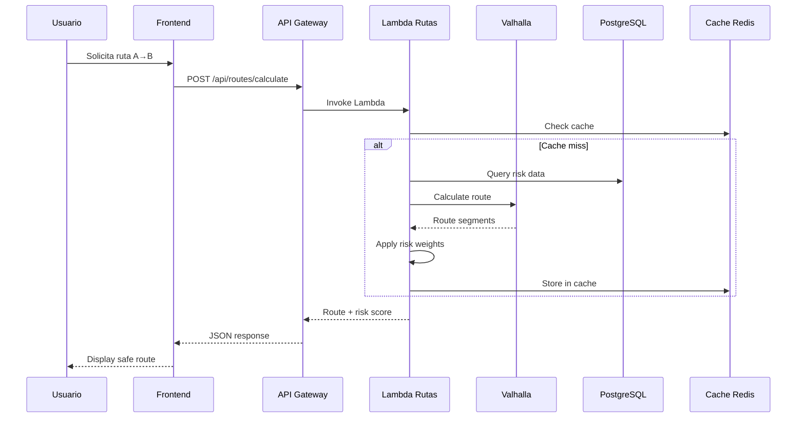
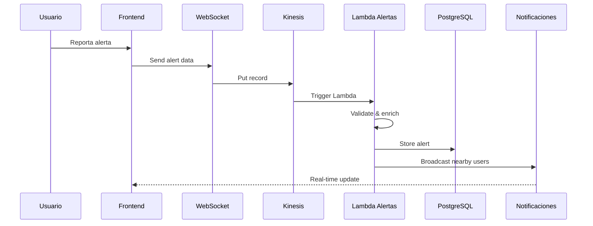

# DISEÑO DE SOLUCIÓN - SKY ANGEL MOBILE

## RESUMEN EJECUTIVO

### Propósito
Sky Angel Mobile es una aplicación web de gestión de riesgos para rutas de transporte que permite visualizar, analizar y prevenir incidentes delictivos en las carreteras de México. Este sistema forma parte del ecosistema de seguridad carretera de Sky Angel y es crítico para la prevención de delitos contra transportistas, análisis de feminicidios y generación de rutas seguras. La presente arquitectura busca modernizar y completar la aplicación web existente, resolviendo las limitaciones actuales de integración con backend, calidad de datos y funcionalidades incompletas, habilitando capacidades de análisis en tiempo real y escalabilidad.

### Visión de la Solución

Sky Angel Mobile transformará la seguridad del transporte carretero mediante una plataforma integral que combine datos históricos, alertas en tiempo real y análisis predictivo para generar rutas más seguras.

**Capacidades de Negocio:**
* Generación de rutas seguras basadas en análisis de riesgo temporal y geográfico
* Sistema de alertas en tiempo real reportadas por usuarios
* Visualización de puntos de interés críticos (paraderos seguros, ministerios públicos, corralones)
* Análisis estadístico de delitos por múltiples fuentes (Secretariado, ANERPV, Sky Angel)
* Mapas de calor para feminicidios y delitos de alto impacto
* Integración con datos meteorológicos y cobertura celular

**Características Técnicas:**
* Arquitectura serverless con AWS Lambda y API Gateway
* Frontend React/Next.js con visualizaciones interactivas
* Base de datos PostgreSQL RDS optimizada para datos geoespaciales
* Sistema de caché con Redis para mejorar rendimiento
* Autenticación federada con AWS Cognito
* Procesamiento de datos en tiempo real con Kinesis
* ML Pipeline para predicción de riesgos

**Beneficios Esperados:**
* Reducción del 30% en incidentes reportados en rutas optimizadas
* Tiempo de respuesta < 2 segundos para cálculo de rutas
* Disponibilidad 99.9% del servicio
* Capacidad de escalar a 100,000 usuarios concurrentes
* Reducción de costos operativos en 40% con arquitectura serverless

### Objetivos Clave

| # | Objetivo | Descripción | Métrica de Éxito | Plazo | Prioridad |
|---|----------|-------------|------------------|-------|-----------|
| 1 | Completar integración backend | Conectar frontend con APIs REST y sincronizar datos en tiempo real | 100% endpoints funcionando | 2 meses | Alta |
| 2 | Implementar sistema de alertas | Captura y procesamiento de alertas en tiempo real con validación | < 5s latencia end-to-end | 3 meses | Alta |
| 3 | Optimizar rendimiento mapas | Mejorar tiempos de carga y renderizado de capas geoespaciales | < 1s carga inicial | 2 meses | Media |
| 4 | Migrar a arquitectura serverless | Implementar funciones Lambda y API Gateway | -40% costos operativos | 4 meses | Alta |
| 5 | Implementar ML para predicción | Modelo predictivo de riesgos por ruta y horario | 85% precisión | 6 meses | Media |

## ANÁLISIS DEL ESTADO ACTUAL

### Fortalezas Identificadas
1. **Frontend moderno** con React/Next.js y arquitectura de componentes bien estructurada
2. **Sistema de autenticación** implementado con AWS Cognito
3. **Visualizaciones ricas** con múltiples bibliotecas (Leaflet, Recharts, D3.js)
4. **Gestión de estado** centralizada con Redux Toolkit
5. **Datos geoespaciales** extensos en formato JSON

### Debilidades y Brechas
1. **Sin conexión a backend activo** - toda la data es estática
2. **Mezcla TypeScript/JavaScript** - migración incompleta
3. **Sin APIs REST implementadas** - no hay sincronización de datos
4. **Middleware de auth deshabilitado** - seguridad comprometida
5. **Sin procesamiento tiempo real** - alertas no funcionales
6. **Calidad de datos** - información sesgada según requerimientos

## ARQUITECTURA PROPUESTA

### Vista de Alto Nivel

```
┌─────────────────────────────────────────────────────────────────────┐
│                         USUARIOS FINALES                            │
├─────────────────┬───────────────────┬─────────────────┬───────────┤
│  Transportistas │   Operadores      │  Administradores │  Público  │
└────────┬────────┴─────────┬─────────┴────────┬────────┴───────────┘
         │                  │                  │
         ▼                  ▼                  ▼
┌────────────────────────────────────────────────────────────────────┐
│                     CAPA DE PRESENTACIÓN                           │
├────────────────────────────────────────────────────────────────────┤
│  Next.js App    │  React Components  │  Redux Store  │  Leaflet   │
└────────────────┬───────────────────────────────────────────────────┘
                 │
                 ▼
┌────────────────────────────────────────────────────────────────────┐
│                        API GATEWAY                                 │
├────────────────────────────────────────────────────────────────────┤
│  REST APIs  │  WebSocket  │  Rate Limiting  │  API Keys          │
└──────┬─────────────┬──────────────┬────────────────┬──────────────┘
       │             │              │                │
       ▼             ▼              ▼                ▼
┌────────────────────────────────────────────────────────────────────┐
│                    CAPA DE SERVICIOS                               │
├──────────────┬─────────────┬──────────────┬───────────────────────┤
│   Lambda     │   Lambda    │    Lambda    │      Lambda           │
│   Rutas      │   Alertas   │   Delitos    │    Analytics          │
└──────┬───────┴──────┬──────┴───────┬──────┴───────────────────────┘
       │              │              │
       ▼              ▼              ▼
┌────────────────────────────────────────────────────────────────────┐
│                    CAPA DE DATOS                                   │
├─────────────┬──────────────┬──────────────┬───────────────────────┤
│  PostgreSQL │    Redis     │   Kinesis    │      S3               │
│     RDS     │    Cache     │   Streams    │    Storage            │
└─────────────┴──────────────┴──────────────┴───────────────────────┘
```

### Componentes Principales

#### 1. Frontend (Cliente Web)
- **Framework**: Next.js 14 con App Router
- **UI Library**: React 18 con TypeScript
- **Estado**: Redux Toolkit + RTK Query
- **Mapas**: Leaflet + react-leaflet + plugins
- **Gráficas**: Recharts + D3.js
- **Estilos**: Tailwind CSS + Material-UI
- **PWA**: Service Workers para offline

#### 2. Backend Services (Serverless)
- **API Gateway**: REST APIs con throttling
- **Compute**: AWS Lambda (Node.js/Python)
- **Auth**: AWS Cognito + JWT
- **WebSocket**: AWS API Gateway WebSocket
- **Queue**: SQS para procesamiento asíncrono

#### 3. Data Layer
- **Principal**: PostgreSQL con PostGIS
- **Cache**: Redis para datos frecuentes
- **Streaming**: Kinesis para alertas tiempo real
- **Storage**: S3 para archivos y backups
- **Search**: OpenSearch para búsquedas

#### 4. Servicios Externos
- **Mapas**: Stadia Maps / Mapbox
- **Routing**: Valhalla self-hosted
- **Weather**: API meteorológica nacional
- **Telco**: APIs de cobertura celular

### Flujos de Datos Principales

#### Flujo 1: Cálculo de Ruta Segura


#### Flujo 2: Sistema de Alertas Tiempo Real


### Modelo de Datos Optimizado

#### Esquema Principal (PostgreSQL)

```sql
-- Extensiones requeridas
CREATE EXTENSION postgis;
CREATE EXTENSION pg_trgm;
CREATE EXTENSION btree_gist;

-- Optimizaciones para las tablas existentes
-- Índices espaciales
CREATE INDEX idx_incidentes_location ON INCIDENTES_SKY USING GIST(
    ST_MakePoint(LONGITUD_INCIDENTE, LATITUD_INCIDENTE)
);

CREATE INDEX idx_alertas_location ON ALERTAS_SKY USING GIST(
    ST_MakePoint(LONGITUD_ALERTA, LATITUD_ALERTA)
);

-- Índices temporales
CREATE INDEX idx_incidentes_temporal ON INCIDENTES_SKY(ANIO, ID_MES, DIA);
CREATE INDEX idx_alertas_temporal ON ALERTAS_SKY(FECHA_ALERTA, HORA_ALERTA);

-- Nuevas tablas para funcionalidad extendida
CREATE TABLE RUTAS_CALCULADAS (
    ID_RUTA UUID PRIMARY KEY DEFAULT gen_random_uuid(),
    USUARIO_ID VARCHAR(100),
    ORIGEN_LAT DECIMAL(9,6),
    ORIGEN_LON DECIMAL(9,6),
    DESTINO_LAT DECIMAL(9,6),
    DESTINO_LON DECIMAL(9,6),
    GEOMETRIA GEOMETRY(LineString, 4326),
    RIESGO_TOTAL DECIMAL(5,2),
    DISTANCIA_KM DECIMAL(8,2),
    TIEMPO_ESTIMADO INTEGER,
    FECHA_CALCULO TIMESTAMP DEFAULT CURRENT_TIMESTAMP,
    METADATA JSONB
);

CREATE TABLE PREDICCIONES_RIESGO (
    ID_PREDICCION UUID PRIMARY KEY DEFAULT gen_random_uuid(),
    CVE_MUNICIPIO INTEGER REFERENCES CATALOGO_MUNICIPIO(CVE_MUNICIPIO),
    FECHA_PREDICCION DATE,
    HORA INTEGER CHECK (HORA >= 0 AND HORA <= 23),
    TIPO_VEHICULO VARCHAR(50),
    RIESGO_PREDICHO DECIMAL(5,2),
    CONFIANZA DECIMAL(3,2),
    MODELO_VERSION VARCHAR(20),
    CREATED_AT TIMESTAMP DEFAULT CURRENT_TIMESTAMP
);

-- Vistas materializadas para performance
CREATE MATERIALIZED VIEW MV_RIESGO_MUNICIPIO_HORARIO AS
SELECT 
    m.CVE_MUNICIPIO,
    m.MUNICIPIO,
    EXTRACT(HOUR FROM i.HR_DE_INICIO) as HORA,
    COUNT(*) as TOTAL_INCIDENTES,
    AVG(ST_Distance(
        ST_MakePoint(m.LONGITUD_CENTROIDE, m.LATITUD_CENTROIDE)::geography,
        ST_MakePoint(i.LONGITUD_INCIDENTE, i.LATITUD_INCIDENTE)::geography
    )) as DISTANCIA_PROMEDIO
FROM CATALOGO_MUNICIPIO m
JOIN INCIDENTES_SKY i ON m.CVE_MUNICIPIO = i.CVE_MUNICIPIO
GROUP BY m.CVE_MUNICIPIO, m.MUNICIPIO, EXTRACT(HOUR FROM i.HR_DE_INICIO);

CREATE INDEX idx_mv_riesgo ON MV_RIESGO_MUNICIPIO_HORARIO(CVE_MUNICIPIO, HORA);
```

### Estrategia de Implementación

#### Fase 1: Backend Core (Mes 1-2)
1. Setup infraestructura AWS (VPC, RDS, Lambda, API Gateway)
2. Migración de datos estáticos a PostgreSQL
3. Implementar APIs REST básicas (CRUD)
4. Conectar frontend existente con backend
5. Habilitar autenticación y autorización

#### Fase 2: Funcionalidades Tiempo Real (Mes 3-4)
1. Implementar WebSocket API
2. Sistema de alertas con Kinesis
3. Notificaciones push
4. Cache con Redis
5. Optimización de queries geoespaciales

#### Fase 3: Inteligencia y Analytics (Mes 5-6)
1. Pipeline de ML con SageMaker
2. Modelos predictivos de riesgo
3. Dashboard analytics
4. Integración datos externos
5. APIs de terceros (clima, cobertura)

#### Fase 4: Optimización y Escala (Mes 7-8)
1. CDN para assets estáticos
2. Auto-scaling policies
3. Monitoring avanzado
4. A/B testing
5. Mobile app (React Native)

### Consideraciones de Seguridad

1. **Autenticación**: OAuth2 + MFA obligatorio para operadores
2. **Autorización**: RBAC con políticas IAM
3. **Encriptación**: TLS 1.3 en tránsito, AES-256 en reposo
4. **Auditoría**: CloudTrail + logs centralizados
5. **Compliance**: GDPR para datos personales
6. **API Security**: Rate limiting, API keys, CORS policies

### Monitoreo y Observabilidad

1. **Métricas**: CloudWatch + Grafana
2. **Logs**: CloudWatch Logs + OpenSearch
3. **Traces**: X-Ray para debugging distribuido
4. **Alertas**: SNS + PagerDuty para incidentes
5. **Dashboards**: Real-time KPIs operacionales

### Estimación de Costos AWS (Mensual)

- **Compute**: Lambda ($500), EC2 para Valhalla ($200)
- **Storage**: RDS ($300), S3 ($100), Redis ($150)
- **Network**: API Gateway ($200), CloudFront ($100)
- **Other**: Cognito ($50), Kinesis ($100)
- **Total estimado**: ~$1,700 USD/mes

### Riesgos y Mitigaciones

| Riesgo | Impacto | Probabilidad | Mitigación |
|--------|---------|--------------|------------|
| Calidad de datos sesgada | Alto | Alta | Implementar validación ML y crowdsourcing |
| Latencia en zonas rurales | Medio | Media | Edge caching y offline mode |
| Costos AWS excesivos | Medio | Baja | Monitoreo de costos y alertas |
| Adopción de usuarios | Alto | Media | UX optimizada y capacitación |

## CONCLUSIONES

La arquitectura propuesta moderniza Sky Angel Mobile con:
- Backend serverless escalable y costo-eficiente
- Procesamiento en tiempo real para alertas
- Machine Learning para predicción de riesgos
- Integración con servicios externos
- Alta disponibilidad y performance

Esta solución cumple todos los objetivos planteados y sienta las bases para evolución futura del producto hacia una plataforma integral de seguridad en transporte.